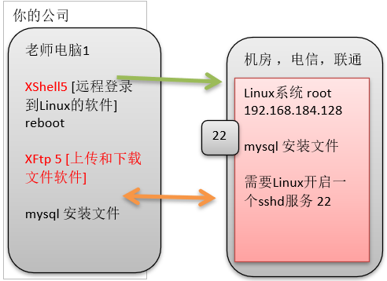

# 第1章 Linux 开山篇

## 1.1 本套 Linux 课程的内容介绍


## 1.2 Linux 的学习方向

### 1.2.1 Linux 运维工程师
### 1.2.2 Linux 嵌入式开发工程师
### 1.2.3 在 Linux 下做各种程序开发
JavaEE、大数据、Python、PHP、C/C++


## 1.3 Linux 的应用领域

### 1.3.1 个人桌面应用领域
此领域是传统linux应用最薄弱的环节，传统linux由于界面简单、操作复杂、应用软件少的缺点，一直被Windows所压制，但近些年来随着`ubuntu`、`fedora [fɪˈdɔ:rə]` 等优秀桌面环境的兴起，同时各大硬件厂商对其支持的加大，linux在个人桌面领域的占有率在逐渐的提高。

### 1.3.2 服务器应用领域
linux在服务器领域的应用是最强的。
linux免费、稳定、高效等特点在这里得到了很好的体现，近些年来linux服务器市场得到了飞速的提升，尤其在一些高端领域尤为广泛。

### 1.3.3 嵌入式应用领域
近些年来linux在嵌入式领域的应用得到了飞速的提高。
linux运行稳定、对网络的良好支持性、低成本，且可以根据需要进行软件裁剪，内核最小可以达到几百KB等特点，使其近些年来在嵌入式领域的应用得到非常大的提高。
主要应用：机顶盒、数字电视、网络电话、程控交换机、手机、PDA、智能家居、智能硬件等都是其应用领域。以后再物联网中应用会更加广泛。


## 1.4 学习 Linux 的阶段（高手进阶过程）
linux是一个开源、免费的操作系统，其稳定性、安全性、处理多并发已经得到业界的认可，目前很多中型，大型甚至是集群项目都在使用linux，很多软件公司考虑到开发成本都首选linux，在中国软件公司得到广泛的使用。

linux学习流程：
1. linux环境下的基本操作命令，包括：文件操作命令(rm mkdir chmod chown)、编辑工具使用（vi vim）、linux用户管理(useradd userdel usermod)等。
2. linux的各种配置（环境变量配置，网络配置，服务配置）。
3. linux下如何搭建对应语言的开发环境（大数据、JavaEE、Python等）。
4. 能编写shell脚本，对Linux服务器进行维护。
5. 能进行安全设置，防止攻击，保障服务器正常运行，能对系统调优。
6. 深入理解Linux系统（对内核有研究），熟练掌握大型网站应用架构组成、并熟悉各个环节的部署和维护方法。


## 1.5 Linux 的学习方法和建议
1. 高效而愉快的学习
2. 先建立一个整体框架，然后细节
3. 不需要掌握所有的Linux指令，要学会查询手册和百度
4. 先know how，再know why
5. 计算机是一门“做中学”的学科，不是会了再做，而是做了才会
6. 适当的囫囵吞枣
7. Linux不是编程，重点是实际操作，各种常用指令要玩的溜


# 第2章 基础篇 Linux 入门

## 2.1 Linux 介绍
linux是一个开源、免费的操作系统，其稳定性、安全性、处理多并发已经得到业界的认可，目前很多企业级的项目都会部署到Linux/Unix系统上。

Linux 吉祥物：【Tux】


Linux发行版：


## 2.2 Unix 是怎么来的


## 2.3 Linux 是怎么来的


## 2.4 Linux 和 Unix 关系一览图


## 2.5 Linux 和 Windows 比较
| 比较       | Window                                                             | Linux                                                                                                                                     |
| ---------- | ------------------------------------------------------------------ | ----------------------------------------------------------------------------------------------------------------------------------------- |
| 免费与收费 | 收费且很贵                                                         | 免费或少许费用                                                                                                                            |
| 软件与支持 | 数量和质量的优势，不过大部分为收费软件；由微软官方提供支持和服务； | 开源自由软件，用户可以修改定制和再发布，由于基本免费没有资金支持，部分软件质量和体验欠缺；有全球所有的Linux开发者和自由软件社区提供支持。 |
| 安全性     | 三天两头打补丁安装系统安全更新，还是会中病毒木马；                 | 相对来说比Windows平台更加安全                                                                                                             |
| 使用习惯   | 依靠鼠标和键盘完成一切操作，上手容易入门简单；                     | 兼具图形界面操作和完全的命令行操作，可以只用键盘完成一切操作，新手入门较困难，需要一些学习和指导，一旦熟练之后效率极高。                  |
| 可定制性   | 封闭的，系统可定制性很差；                                         | 开源，可定制化非常强。                                                                                                                    |
| 应用场景   | 桌面操作系统主要使用的是window。                                   | 支撑百度，谷歌，淘宝等应用软件和服务的，是后台成千上万的Linux服务器主机。世界上大部分软件和服务都是运行在Linux之上的。                    |


# 第3章 基础篇 VM 和 Linux 系统(CENTOS)安装

## 3.1 Windows 和 VM 和 CentOS 的关系说明


## 3.2 CENTOS 安装的步骤
VM 安装前记得去BIOS开启虚拟化设备支持

虚拟机的网络连接三种形式的说明


## 3.3 VMTOOLS

### 3.3.1 介绍
vmtools 安装后，可以让我们在Windows下更好的管理vm虚拟机
1. 可以直接粘贴命令在Windows和centos系统之间
2. 可以设置Windows和centos的共享文件夹
    

### 3.3.2 安装步骤
1. 进入centos
2. 点击vm菜单的->install vmware tools
3. centos会出现一个vm的安装包
4. 解压，进入解压目录
6. 安装 `./vmware-install.pl`
7. 全部使用默认设置即可
8. 需要reboot重新启动即可生效

### 3.3.3 设置 Windows 和 Linux 的共享文件夹
1. 菜单->vm->setting
   1. 注意：设置Shared Folders选项为always enable
2. windows和centos可共享指定目录
3. 在centos的 `/mnt/hgfs/` 下

实际开发中，文件的上传下载是使用远程方式完成的。


# 第4章 基础篇 Linux 的目录结构

## 4.1 基本介绍
linux的文件系统是采用级层式的树状目录结构，在此结构中的最上层是根目录`/`，然后在此目录下再创建其他的目录。
Linux的各个目录存放的内容是规划好的，最好不要乱放文件。
一句话：在Linux世界里，一切皆文件。


## 4.2 目录结构的具体介绍
[树状目录结构](https://www.runoob.com/wp-content/uploads/2014/06/d0c50-linux2bfile2bsystem2bhierarchy.jpg)

- /bin
  - bin是Binaries(二进制文件)的缩写，这个目录存放着最经常使用的命令。
- /boot
  - 这里存放的是启动Linux时使用的一些核心文件，包括一些连接文件以及镜像文件。
- /dev
  - dev是Device(设备)的缩写，该目录下存放的是Linux的外部设备，在Linux中访问设备的方式和访问文件的方式是相同的。
- /etc
  - etc是Etcetera(等等)的缩写，这个目录用来存放所有的系统管理所需要的配置文件和子目录。
- /home
  - 用户的主目录，在Linux中，每个用户都有一个自己的目录，一般该目录名是以用户的账号命名的，如上图中的alice、bob和eve。
- /lib
  - lib是Library(库)的缩写这个目录里存放着系统最基本的动态连接共享库，其作用类似于Windows里的DLL文件。几乎所有的应用程序都需要用到这些共享库。
- /lost+found
  - 这个目录一般情况下是空的，当系统非法关机后，这里就存放了一些文件。
- /media
  - linux系统会自动识别一些设备，例如U盘、光驱等等，当识别后，Linux会把识别的设备挂载到这个目录下。
- /mnt
  - 系统提供该目录是为了让用户临时挂载别的文件系统的，我们可以将光驱挂载在/mnt/上，然后进入该目录就可以查看光驱里的内容了。
- /opt
  - opt是optional(可选)的缩写，这是给主机额外安装软件所摆放的目录。比如你安装一个ORACLE数据库则就可以放到这个目录下。默认是空的。
- /proc
  - proc是Processes(进程)的缩写，/proc是一种伪文件系统（也即虚拟文件系统），存储的是当前内核运行状态的一系列特殊文件，这个目录是一个虚拟的目录，它是系统内存的映射，我们可以通过直接访问这个目录来获取系统信息。
  - 这个目录的内容不在硬盘上而是在内存里，我们也可以直接修改里面的某些文件，比如可以通过下面的命令来屏蔽主机的ping命令，使别人无法ping你的机器: `echo 1 > /proc/sys/net/ipv4/icmp_echo_ignore_all`
- /root
  - 该目录为系统管理员，也称作超级权限者的用户主目录。
- /sbin
  - s就是SuperUser的意思，是SuperuserBinaries(超级用户的二进制文件)的缩写，这里存放的是系统管理员使用的系统管理程序。
- /selinux
  - 这个目录是Redhat/CentOS所特有的目录，Selinux（security-enhanced linux）是一个安全机制，类似于windows的防火墙，但是这套机制比较复杂，这个目录就是存放selinux相关的文件的。
- /srv
  - 该目录存放一些服务启动之后需要提取的数据。
- /sys
  - 这是Linux2.6内核的一个很大的变化。该目录下安装了2.6内核中新出现的一个文件系统sysfs。
  - sysfs文件系统集成了下面3种文件系统的信息：针对进程信息的proc文件系统、针对设备的devfs文件系统以及针对伪终端的devpts文件系统。
  - 该文件系统是内核设备树的一个直观反映。
  - 当一个内核对象被创建的时候，对应的文件和目录也在内核对象子系统中被创建。
- /tmp
  - tmp是temporary(临时)的缩写这个目录是用来存放一些临时文件的。
- /usr
  - usr是unix shared resources(共享资源)的缩写，这是一个非常重要的目录，用户的很多应用程序和文件都放在这个目录下，类似于windows下的programfiles目录。
  - /usr/bin
    - 系统用户使用的应用程序。
  - /usr/sbin
    - 超级用户使用的比较高级的管理程序和系统守护程序。
  - /usr/src
    - 内核源代码默认的放置目录。
  - /usr/local
    - 另一个给主机额外安装软件所安装的目录。一般是通过编译源码方式安装的程序。
- /var
  - var是variable(变量)的缩写，这个目录中存放着在不断扩充着的东西，我们习惯将那些经常被修改的目录放在这个目录下。包括各种日志文件。
- /run
  - 是一个临时文件系统，存储系统启动以来的信息。当系统重启时，这个目录下的文件应该被删掉或清除。如果你的系统上有/var/run目录，应该让它指向run。


## 4.3 几个比较重要的目录
在Linux系统中，有几个目录是比较重要的，平时需要注意不要误删除或者随意更改内部文件。
- /etc
  - 上边也提到了，这个是系统中的配置文件，如果你更改了该目录下的某个文件可能会导致系统不能启动。
- /bin，/sbin，/usr/bin，/usr/sbin
  - 这是系统预设的执行文件的放置目录，比如ls就是在/bin/ls目录下的。
  - 值得提出的是/bin、/usr/bin是给系统用户使用的指令（除root外的通用用户），而/sbin，/usr/sbin则是给root使用的指令。
- /var
  - 这是一个非常重要的目录，系统上跑了很多程序，那么每个程序都会有相应的日志产生，而这些日志就被记录到这个目录下，具体在/var/log目录下，另外mail的预设放置也是在这里。


---
# 第5章 实操篇 远程登录 Linux 系统

## 5.1 为什么需要远程登录 Linux

### 5.1.1 示意图


### 5.1.2 说明
1. linux服务器是开发小组共享的
2. 正式上线的项目是运行在公网的
3. 因此程序员需要远程登录到centos进行项目管理或者开发
4. 画出简单的网络拓扑示意图(帮助理解)
5. 远程登录客户端有Xshell和Xftp，其它的远程工具大同小异


## 5.2 远程登录 Linux-Xshell5

### 5.2.1 Xshell5 软件介绍
Xshell是目前最好的远程登录到Linux操作的软件，流畅的速度并且完美解决了中文乱码的问题，是目前程序员首选的软件。
Xshell是一个强大的安全终端模拟软件，它支持SSH1、SSH2，以及Microsoft Windows平台的TELNET协议。
Xshell可以在Windows界面下用来访问远端不同系统下的服务器，从而比较好的达到远程控制终端的目的。

特别说明：如果希望安装好XShell 5就可以远程访问Linux系统的话，需要有一个前提，就是Linux启用了SSHD服务，该服务会监听22号端口。

### 5.2.2 Xshell5 的配置


远程登录到 Linux 后，就可以使用指令来操作 Linux 系统


## 5.3 远程上传下载文件 Xftp5

### 5.3.1 Xftp5 软件介绍
是一个基于Windows 平台的功能强大的SFTP、FTP文件传输软件。使用了Xftp以后，Windows用户能安全地在 `UNIX/Linux` 和Windows PC之间传输文件。

### 5.3.2 Xftp5 的配置


### 5.3.3 如何解决 Xftp5 中文乱码的问题


# 第6章 实操篇 VI 和 VIM 编辑器

## 6.1 VI 和 VIM 的基本介绍
所有的Linux系统都会内建vi文本编辑器。
Vim具有程序编辑的能力，可以看做是vi的增强版本，可以主动的以字体颜色辨别语法的正确性，方便程序设计。代码补完、编译及错误跳转等方便编程的功能特别丰富，在程序员中被广泛使用。


## 6.2 vi/vim 的使用
基本上 `vi/vim` 共分为三种模式，分别是命令模式（Command mode），输入模式（Insert mode）和底线命令模式（Last line mode）。
这三种模式的作用分别是：

### 命令模式：
用户刚刚启动 vi/vim，便进入了命令模式。
此状态下敲击键盘动作会被Vim识别为命令，而非输入字符。比如我们此时按下i，并不会输入一个字符，i被当作了一个命令。

以下是常用的几个命令：
- i 切换到输入模式，以输入字符。
- x 删除当前光标所在处的字符。
- : 切换到底线命令模式，以在最底一行输入命令。

若想要编辑文本：启动Vim，进入了命令模式，按下i，切换到输入模式。

命令模式只有一些最基本的命令，因此仍要依靠底线命令模式输入更多命令。

### 输入模式
在命令模式下按下i就进入了输入模式。

在输入模式中，可以使用以下按键：
- 字符按键以及Shift组合，输入字符
- ENTER，回车键，换行
- BACK SPACE，退格键，删除光标前一个字符
- DEL，删除键，删除光标后一个字符
- 方向键，在文本中移动光标
- HOME/END，移动光标到行首/行尾
- Page Up/Page Down，上/下翻页
- Insert，切换光标为输入/替换模式，光标将变成竖线/下划线
- ESC，退出输入模式，切换到命令模式

### 底线命令模式
在命令模式下按下:（英文冒号）就进入了底线命令模式。

底线命令模式可以输入单个或多个字符的命令，可用的命令非常多。

在底线命令模式中，基本的命令有（已经省略了冒号）：
- q 退出程序
- w 保存文件

按ESC键可随时退出底线命令模式。

三个模式：


## 6.3 VIM 和 VI 的快捷键键盘一览图
vim 键盘图：


[Linux vi/vim](https://www.runoob.com/linux/linux-vim.html)


# 第7章 实操篇 开机、重启和用户登录注销

## 7.1 关机&重启命令

### 7.1.1 基本介绍
| .               | .                      |
| --------------- | ---------------------- |
| shutdown –h now | 立该进行关机           |
| shutdown –r now | 现在重新启动计算机     |
| halt            | 关机                   |
| reboot          | 现在重新启动计算机     |
| sync            | 把内存的数据同步到磁盘 |

### 7.1.2 注意细节
不管是重启系统还是关闭系统，首先要运行sync命令，把内存中的数据写到磁盘中


## 7.2 用户登录和注销

### 7.2.1 基本介绍
- 登录时尽量少用root帐号登录，因为它是系统管理员，最大的权限，避免操作失误。可以利用普通用户登录，登录后再用"su 用户名"命令来切换成系统管理员身份
- 在提示符下输入logout即可注销用户

### 7.2.2 使用细节
- logout 注销指令在图形运行级别无效，在 运行级别3 下有效
- 运行级别这个概念，后面介绍


# 第8章 实操篇 用户和用户组管理

## 8.1 基本介绍

1. Linux系统是一个多用户多任务的分时操作系统，任何一个要使用系统资源的用户，都必须首先向系统管理员申请一个账号，然后以这个账号的身份进入系统。
2. Linux的用户需要至少要属于一个组。


## 8.2 用户管理

### 8.2.1 添加用户
```
useradd 选项 用户名
```

选项
- `-c comment` 指定一段注释性描述。
- `-d 目录` 指定用户主目录，如果此目录不存在，则同时使用-m选项，可以创建主目录。如不指定该参数，会自动的创建和用户同名的家目录。
- `-g 用户组` 指定用户所属的用户组。
- `-G 用户组`，指定用户所属的附加组。
- `-s Shell文件` 指定用户的登录Shell。
- `-u 用户号` 指定用户的用户号，如果同时有-o选项，则可以重复使用其他用户的标识号。

用户名
- 指定新账号的登录名。

### 8.2.2 删除用户
```
userdel 选项 用户名
```

选项
- `-r` 把用户的主目录一起删除。不过在删除用户时，我们一般不会将家目录删除。

### 8.2.3 修改用户
```
usermod 选项 用户名
```

选项同useradd命令为用户指定新的资源值。

密码的修改见【用户口令管理】

### 8.2.4 查询用户
```
id 用户名
```

### 8.2.5 管理用户口令
用户账号刚创建时没有口令，但是被系统锁定，无法使用，必须为其指定口令后才可以使用，即使是指定空口令。

指定和修改用户口令的Shell命令是passwd。超级用户可以为自己和其他用户指定口令，普通用户只能用它修改自己的口令。
```
passwd 选项 用户名
```

选项
- `-l` 锁定口令，即禁用账号。
- `-u` 口令解锁。
- `-d` 使账号无口令。
- `-f` 强迫用户下次登录时修改口令。

缺省用户名，默认修改当前用户的口令。

### 8.2.6 切换用户
```
su 选项 用户名
```

选项
- `-` 当前用户不仅切换为指定用户的身份，同时所用的工作环境也切换为此用户的环境（包括 PATH 变量、MAIL 变量等），使用 - 选项可省略用户名，默认会切换为 root 用户。
- `-l` 同 - 的使用类似，也就是在切换用户身份的同时，完整切换工作环境，但后面需要添加欲切换的使用者账号。
- `-p` 表示切换为指定用户的身份，但不改变当前的工作环境（不使用切换用户的配置文件）。
- `-m` 同 -p 。
- `-c` 仅切换用户执行一次命令，执行后自动切换回来，该选项后通常会带有要执行的命令。

小结
- 从权限高的用户切换到权限低的用户，不需要输入密码，反之需要。
- 当需要返回到原来用户时，使用 exit 指令


## 8.3 用户组管理

### 8.3.1 介绍
类似于角色，系统可以对一个用户组中的所有用户进行集中管理。

### 8.3.2 增加组
```
groupadd 选项 用户组
```

选项
- `-g GID` 指定新用户组的组标识号（GID）。
- `-o` 一般与-g选项同时使用，表示新用户组的GID可以与系统已有用户组的GID相同。

### 8.3.3 删除组
```
groupdel 用户组
```

### 8.3.4 修改组
```
groupmod 选项 用户组
```

选项
- `-g GID` 为用户组指定新的组标识号。
- `-o` 与-g选项同时使用，用户组的新GID可以与系统已有用户组的GID相同。
- `-n 新用户组` 将用户组的名字改为新名字。

### 8.3.5 切换组
```
newgrp 组名
```
如果一个用户同时属于多个用户组，那么用户可以在登录后，使用命令newgrp切换到其他用户组，以便具有其他用户组的权限。


## 8.4 相关文件

### 8.4.1 /ETC/PASSWD 文件
Linux系统中的每个用户都在/etc/passwd文件中有一个对应的记录行，它记录了这个用户的一些基本属性。
这个文件对所有用户都是可读的。

每行记录又被冒号(:)分隔为7个字段，其格式和具体含义如下：
```
用户名:口令:用户标识号:组标识号:注释性描述:主目录:登录Shell
```

### 8.4.2 /ETC/SHADOW 文件
/etc/shadow中的记录行与/etc/passwd中的一一对应，它由pwconv命令根据/etc/passwd中的数据自动产生

它的文件格式与/etc/passwd类似，由若干个字段组成，字段之间用":"隔开。这些字段是：
```
登录名:加密口令:最后一次修改时间:最小时间间隔:最大时间间隔:警告时间:不活动时间:失效时间:标志
```

- "登录名"是与/etc/passwd文件中的登录名相一致的用户账号
- "口令"字段存放的是加密后的用户口令字，长度为13个字符。如果为空，则对应用户没有口令，登录时不需要口令；如果含有不属于集合 { ./0-9A-Za-z }中的字符，则对应的用户不能登录。
- "最后一次修改时间"表示的是从某个时刻起，到用户最后一次修改口令时的天数。时间起点对不同的系统可能不一样。例如在SCO Linux 中，这个时间起点是1970年1月1日。
- "最小时间间隔"指的是两次修改口令之间所需的最小天数。
- "最大时间间隔"指的是口令保持有效的最大天数。
- "警告时间"字段表示的是从系统开始警告用户到用户密码正式失效之间的天数。
- "不活动时间"表示的是用户没有登录活动但账号仍能保持有效的最大天数。
- "失效时间"字段给出的是一个绝对的天数，如果使用了这个字段，那么就给出相应账号的生存期。期满后，该账号就不再是一个合法的账号，也就不能再用来登录了。

### 8.4.3 /ETC/GROUP 文件
用户组的所有信息都存放在/etc/group文件中。此文件的格式也类似于/etc/passwd文件，由冒号(:)隔开若干个字段，这些字段有：
```
组名:口令:组标识号:组内用户列表
```

- "组名"是用户组的名称，由字母或数字构成。与/etc/passwd中的登录名一样，组名不应重复。
- "口令"字段存放的是用户组加密后的口令字。一般Linux 系统的用户组都没有口令，即这个字段一般为空，或者是*。
- "组标识号"与用户标识号类似，也是一个整数，被系统内部用来标识组。
- "组内用户列表"是属于这个组的所有用户的列表，不同用户之间用逗号(,)分隔。这个用户组可能是用户的主组，也可能是附加组。


# 第9章 实操篇 实用指令

## 9.1 指定运行级别
- 0: 关机
- 1: 单用户【找回丢失密码】
- 2: 多用户状态没有网络服务
- 3: 多用户状态有网络服务
- 4: 系统未使用保留给用户
- 5: 图形界面
- 6: 系统重启

常用运行级别是3和5，要修改默认的运行级别可改文件/etc/inittab的id:5:initdefault:这一行中的数字


## 9.2 切换到指定运行级别的指令

### 9.2.1 基本语法
```
init [012356]
```

### 9.2.2 修改root密码
开机引导页按`e`，` 1`设置单用户模式，`b`引导，进入后设置密码即可。


## 9.3 帮助指令
man：获得帮助信息
```
man [命令或配置文件]
```

help指令：获得shell内置命令的帮助信息
```
help [命令]
```


## 9.4 文件目录类

### 9.4.1 pwd 指令
print work directory，显示目前所在的工作目录的绝对路径
```
pwd [--help] [--version]
```

参数
- `--help` 在线帮助。
- `--version` 显示版本信息。

### 9.4.2 ls 指令
list files，显示指定工作目录下所含文件及子目录。
```
ls [-alrtAFR] [name...]
```

参数
- `-a` 显示所有文件及目录 (. 开头的隐藏文件也会列出)
- `-l` 除文件名称外，亦将文件型态、权限、拥有者、文件大小等资讯详细列出（ll -> ls -l）
- `-r` 将文件以相反次序显示(原定依英文字母次序)
- `-t` 将文件依建立时间之先后次序列出
- `-A` 同 -a ，但不列出 "." (目前目录) 及 ".." (父目录)
- `-F` 在列出的文件名称后加一符号；例如可执行档则加 "*"，目录则加 "/"
- `-R` 若目录下有文件，则以下之文件亦皆依序列出

### 9.4.3 cd 指令
change directory，切换当前工作目录。
```
cd [dirName]
```

其中 dirName 表示法可为绝对路径或相对路径。
若目录名称省略，则变换至使用者的 home 目录 (也就是刚 login 时所在的目录)。
- `~` home目录
- `.` 目前所在的目录
- `..` 目前目录位置的上一层目录

### 9.4.4 mkdir 指令
make directory，命令用于创建目录。
```
mkdir [-p] dirName
```

参数
- `-p` 确保目录名称存在，不存在的就建一个。常用于创建多级目录。

### 9.4.5 rmdir 指令
remove directory，删除空的目录。
```
rmdir [-p] dirName
```

参数
- `-p` 删除子目录使父目录为空，则删除父目录。

### 9.4.6 touch 指令
用于修改文件或者目录的时间属性，包括存取时间和更改时间。若文件不存在，系统会建立一个新的文件。
```
touch [-acfm] [-d <日期时间>] [-r <参考文件或目录>] [-t <日期时间>] [--help] [--version] [文件或目录...]
```

参数
- `a` 改变档案的读取时间记录。
- `m` 改变档案的修改时间记录。
- `c` 假如目的档案不存在，不会建立新的档案。与 --no-create 的效果一样。
- `f` 不使用，是为了与其他 unix 系统的相容性而保留。
- `r` 使用参考档的时间记录，与 --file 的效果一样。
- `d` 设定时间与日期，可以使用各种不同的格式。
- `t` 设定档案的时间记录，格式与 date 指令相同。
- `--no-create` 不会建立新档案。
- `--help` 列出指令格式。
- `--version` 列出版本讯息。

### 9.4.7 cp 指令【重要】
copy file，复制文件或目录。
```
cp [options] source dest
```
或
```
cp [options] source... directory
```

参数
- `-a` 此选项通常在复制目录时使用，它保留链接、文件属性，并复制目录下的所有内容。其作用等于dpr参数组合。
- `-d` 复制时保留链接。这里所说的链接相当于 Windows 系统中的快捷方式。
- `-f` 覆盖已经存在的目标文件而不给出提示。（直接使用`\cp`命令似乎也可以）
- `-i` 与 -f 选项相反，在覆盖目标文件之前给出提示，要求用户确认是否覆盖，回答 y 时目标文件将被覆盖。
- `-p` 除复制文件的内容外，还把修改时间和访问权限也复制到新文件中。
- `-r` 若给出的源文件是一个目录文件，此时将复制该目录下所有的子目录和文件。
- `-l` 不复制文件，只是生成链接文件。

### 9.4.8 rm 指令
remove，删除一个文件或者目录。
```
rm [options] name...
```

参数
- `-i` 删除前逐一询问确认。
- `-f` 即使原档案属性设为唯读，亦直接删除，无需逐一确认。
- `-r` 将目录及以下之档案亦逐一删除。

### 9.4.9 mv 指令
move file，为文件或目录改名、或将文件或目录移入其它位置。
```
mv [options] source dest
mv [options] source... directory
```
参数
- `-b` 当目标文件或目录存在时，在执行覆盖前，会为其创建一个备份。
- `-i` 如果指定移动的源目录或文件与目标的目录或文件同名，则会先询问是否覆盖旧文件，输入 y 表示直接覆盖，输入 n 表示取消该操作。
- `-f` 如果指定移动的源目录或文件与目标的目录或文件同名，不会询问，直接覆盖旧文件。
- `-n` 不要覆盖任何已存在的文件或目录。
- `-u` 当源文件比目标文件新或者目标文件不存在时，才执行移动操作。

mv 参数设置与运行结果
| 命令格式                                       | 运行结果                                                                                                                                                      |
| ---------------------------------------------- | ------------------------------------------------------------------------------------------------------------------------------------------------------------- |
| mv source_file(文件) dest_file(文件)           | 将源文件名 source_file 改为目标文件名 dest_file                                                                                                               |
| mv source_file(文件) dest_directory(目录)      | 将文件 source_file 移动到目标目录 dest_directory 中                                                                                                           |
| mv source_directory(目录) dest_directory(目录) | 目录名 dest_directory 已存在，将 source_directory 移动到目录名 dest_directory 中；目录名 dest_directory 不存在则 source_directory 改名为目录名 dest_directory |
| mv source_directory(目录) dest_file(文件)      | 出错                                                                                                                                                          |

### 9.4.10 cat 指令
concatenate，连接文件并打印到标准输出设备上。
```
cat [-AbeEnstTuv] [--help] [--version] fileName
```

参数
- `-n`, `--number` 由 1 开始对所有输出的行数编号。
- `-b`, `--number-nonblank` 和 `-n` 相似，只不过对于空白行不编号。
- `-s`, `--squeeze-blank` 当遇到有连续两行以上的空白行，就代换为一行的空白行。
- `-v`, `--show-nonprinting` 使用 `^` 和 `M-` 符号，除了 LFD 和 TAB 之外。
- `-E`, `--show-ends` 在每行结束处显示 `$`
- `-T`, `--show-tabs` 将 TAB 字符显示为 `^I`
- `-A`, `--show-all` 等价于 `-vET`
- `-e` 等价于 `-vE`。
- `-t` 等价于 `-vT`。

### 9.4.11 more 指令
类似 cat，不过会以一页一页的形式显示，更方便使用者逐页阅读，而最基本的指令就是按空白键（space）就往下一页显示，按 b 键就会往回（back）一页显示，而且还有搜寻字串的功能（与 vi 相似），使用中的说明文件，请按 h 。
```
more [-dlfpcsu] [-num] [+/pattern] [+linenum] [fileNames...]
```

参数
- `-num` 一次显示的行数
- `-d` 提示使用者，在画面下方显示 [Press space to continue, 'q' to quit.] ，如果使用者按错键，则会显示 [Press 'h' for instructions.] 而不是 '哔' 声
- `-l` 取消遇见特殊字元 ^L（送纸字元）时会暂停的功能
- `-f` 计算行数时，以实际上的行数，而非自动换行过后的行数（有些单行字数太长的会被扩展为两行或两行以上）
- `-p` 不以卷动的方式显示每一页，而是先清除萤幕后再显示内容
- `-c` 跟 -p 相似，不同的是先显示内容再清除其他旧资料
- `-s` 当遇到有连续两行以上的空白行，就代换为一行的空白行
- `-u` 不显示下引号 （根据环境变数 TERM 指定的 terminal 而有所不同）
- `+/pattern` 在每个文档显示前搜寻该字串（pattern），然后从该字串之后开始显示
- `+num` 从第 num 行开始显示
- `fileNames` 欲显示内容的文档，可为复数个数

常用操作命令
- Enter 向下n行，需要定义。默认为1行
- Ctrl+F 向下滚动一屏
- 空格键 向下滚动一屏
- Ctrl+B 返回上一屏
- = 输出当前行的行号
- :f 输出文件名和当前行的行号
- V 调用vi编辑器
- !命令 调用Shell，并执行命令
- q 退出more

### 9.4.12 less 指令
与 more 类似，less 可以随意浏览文件，支持翻页和搜索，支持向上翻页和向下翻页。
```
less [参数] 文件
```

参数
- `-b <缓冲区大小>` 设置缓冲区的大小
- `-e` 当文件显示结束后，自动离开
- `-f` 强迫打开特殊文件，例如外围设备代号、目录和二进制文件
- `-g` 只标志最后搜索的关键词
- `-i` 忽略搜索时的大小写
- `-m` 显示类似more命令的百分比
- `-N` 显示每行的行号
- `-o <文件名>` 将less 输出的内容在指定文件中保存起来
- `-Q` 不使用警告音
- `-s` 显示连续空行为一行
- `-S` 行过长时间将超出部分舍弃
- `-x <数字>` 将"tab"键显示为规定的数字空格
- `/字符串` 向下搜索"字符串"
- `?字符串` 向上搜索"字符串"
- `n` 重复前一个搜索（与 / 或 ? 有关）
- `N` 反向重复前一个搜索（与 / 或 ? 有关）
- `b` 向上翻一页
- `d` 向后翻半页
- `h` 显示帮助界面
- `Q` 退出less 命令
- `u` 向前滚动半页
- `y` 向前滚动一行

常用操作命令
- 空格键 滚动一页
- 回车键 滚动一行
- pagedown 向下翻动一页
- pageup 向上翻动一页
- 全屏导航
  - ctrl + F 向前移动一屏
  - ctrl + B 向后移动一屏
  - ctrl + D 向前移动半屏
  - ctrl + U 向后移动半屏
- 单行导航
  - j 下一行
  - k 上一行
- 其它导航
  - G 移动到最后一行
  - g 移动到第一行
  - q/ZZ 退出 less 命令
- 其它有用的命令
  - v 使用配置的编辑器编辑当前文件
  - h 显示 less 的帮助文档
  - &pattern 仅显示匹配模式的行，而不是整个文件
- 标记导航，当使用 less 查看大文件时，可以在任何一个位置作标记，可以通过命令导航到标有特定标记的文本位置：
  - ma 使用 a 标记文本的当前位置
  - 'a 导航到标记 a 处

### 9.4.13 > 指令 和 >> 指令
- `command > file` 将输出重定向到 file。
- `command >> file` 将输出以追加的方式重定向到 file。

### 9.4.14 echo 指令
输出内容到控制台。

### 9.4.15 head 指令
查看文件的开头部分的内容，有一个常用的参数 -n 用于显示行数，默认为 10，即显示 10 行的内容。
```
head [参数] [文件]
```

参数
- `-q` 隐藏文件名
- `-v` 显示文件名
- `-c<数目>` 显示的字节数。
- `-n<行数>` 显示的行数。

### 9.4.16 tail 指令
查看文件结尾部分的内容，有一个常用的参数 -f 常用于查阅正在改变的日志文件。

`tail -f filename` 会把 filename 文件里的最尾部的内容显示在屏幕上，并且不断刷新，只要 filename 更新就可以看到最新的文件内容。
```
tail [参数] [文件]
```

参数
- `-f` 循环读取
- `-q` 不显示处理信息
- `-v` 显示详细的处理信息
- `-c<数目>` 显示的字节数
- `-n<行数>` 显示文件的尾部 n 行内容
- `--pid=PID` 与-f合用,表示在进程ID,PID死掉之后结束
- `-q, --quiet, --silent` 从不输出给出文件名的首部
- `-s, --sleep-interval=S` 与-f合用,表示在每次反复的间隔休眠S秒

### 9.4.17 ln 指令
link files，为某一个文件在另外一个位置建立一个同步的链接。
```
ln [参数] [源文件或目录] [目标文件或目录]
```

其中参数的格式为
```
[-bdfinsvF] [-S backup-suffix] [-V {numbered,existing,simple}]
[--help] [--version] [--]
```

参数
- `-b` 删除，覆盖以前建立的链接
- `-d` 允许超级用户制作目录的硬链接
- `-f` 强制执行
- `-i` 交互模式，文件存在则提示用户是否覆盖
- `-n` 把符号链接视为一般目录
- `-s` 软链接(符号链接)
- `-v` 显示详细的处理过程

注：使用pwd指令查看目录时，仍然看到的是软链接所在目录。

### 9.4.18 history 指令
显示历史记录和执行过的指令命令。
```
history [选项] [参数]
```

选项
- `-N` 显示历史记录中最近的N个记录；
- `-c` 清空当前历史命令；
- `-a` 将历史命令缓冲区中命令写入历史命令文件中；
- `-r` 将历史命令文件中的命令读入当前历史命令缓冲区；
- `-w` 将当前历史命令缓冲区命令写入历史命令文件中;
- `-d<offset>` 删除历史记录中第offset个命令
- `-n<filename>` 读取指定文件


## 9.5 时间日期类

### 9.5.1 date 指令
```
date [OPTION]... [+FORMAT]
```

参数
- `-d, --date=STRING` 通过字符串显示时间格式，字符串不能是'now'。
- `-f, --file=DATEFILE` 类似于--date; 一次从DATEFILE处理一行。
- `-I[FMT], --iso-8601[=FMT]` 按照 ISO 8601 格式输出时间，FMT 可以为'date'(默认)，'hours'，'minutes'，'seconds'，'ns'。 可用于设置日期和时间的精度，例如：2006-08-14T02:34:56-0600。
- `-R, --rfc-2822` 按照 RFC 5322 格式输出时间和日期，例如: Mon, 14 Aug 2006 02:34:56 -0600。
- `--rfc-3339=FMT` 按照 RFC 3339 格式输出，FMT 可以为'date', 'seconds','ns'中的一个，可用于设置日期和时间的精度， 例如：2006-08-14 02:34:56-06:00。
- `-r, --reference=FILE` 显示文件的上次修改时间。
- `-s, --set=STRING` 根据字符串设置系统时间。
- `-u, --utc, --universal` 显示或设置协调世界时(UTC)。
- `--help` 显示帮助信息。
- `--version` 输出版本信息。

### 9.5.2 cal 指令
直接使用显示本月日历


## 9.6 搜索查找类

### 9.6.1 find 指令
在指定目录下查找文件。任何位于参数之前的字符串都将被视为欲查找的目录名。如果使用该命令时，不设置任何参数，则 find 命令将在当前目录下查找子目录与文件。并且将查找到的子目录和文件全部进行显示。
```
find path -option [-print] [-exec -ok command] {} \;
```

参数
- `-name name, -iname name` 文件名称符合 name 的文件。iname 会忽略大小写
- `user username` 查找属于指定用户的所有文件
- `-size [+|-]n` 按照指定的文件大小查找文件。+大于指定大小，-小于指定大小。单位：kM...
- `-type c` 文件类型是 c 的文件。

### 9.6.2 locate 指令
查找符合条件的文档，他会去保存文档和目录名称的数据库内，查找合乎范本样式条件的文档或目录。
```
locate [-d] [--help] [--version] [范本样式...]
```

附加说明：locate并不是真的查找，而是查数据库，一般文件数据库在 /var/lib/slocate/slocate.db 中，所以 locate 的查找并不是实时的，而是以数据库的更新为准，一般是系统自己维护，也可以手工升级数据库 ，命令为：updatedb

### 9.6.3 grep 指令和 管道符号 |
查找文件里符合条件的字符串。

查找内容包含指定的范本样式的文件，如果发现某文件的内容符合所指定的范本样式，预设 grep 指令会把含有范本样式的那一列显示出来。
若不指定任何文件名称，或是所给予的文件名为 -，则 grep 指令会从标准输入设备读取数据。
```
grep [-abcEFGhHilLnqrsvVwxy][-A<显示行数>][-B<显示列数>][-C<显示列数>][-d<进行动作>][-e<范本样式>][-f<范本文件>][--help][范本样式][文件或目录...]
```

参数
- `-i, --ignore-case  忽略字符大小写的差别。
- `-n, --line-number` 在显示符合样式的那一行之前，标示出该行的列数编号。
- `-y` 此参数的效果和指定"-i"参数相同。


## 9.7 压缩和解压类

### 9.7.1 gzip/gunzip 指令
gzip 文件: 压缩文件，只能将文件压缩为*.gz文件

gunzip文件.gz: 解压缩文件命令）

细节说明：当我们使用 gzip 对文件进行压缩后，不会保留原来的文件。

### 9.7.2 zip/unzip 指令
`zip [选项] XXX.zip 将要压缩的内容`: 压缩文件和目录
- `-r` 递归压缩，即压缩目录

`unzip [选项] XXX.zip`: 解压缩文件
- `-d <目录>` 指定解压后文件的存放目录

### 9.7.3 tar 指令
tape archive，打包指令，最后打包后的文件是 .tar.gz 的文件。
```
tar [-选项] [文件或目录...]
```

参数：
- `-c, --create` 建立新的备份文件。
- `-f <备份文件>, --file=<备份文件>` 指定备份文件。
- `-v, --verbose` 显示指令执行过程。
- `-x, --extract, --get` 从备份文件中还原文件。
- `-z, --gzip, --ungzip` 通过gzip指令处理备份文件。


# 第10章 实操篇 组管理和权限管理

## 10.1 Linux 组基本介绍
在linux中的每个用户必须属于一个组，不能独立于组外。
在linux中每个文件有所有者、所在组、其它组的概念。


## 10.2 文件/目录 所有者
一般为文件的创建者，谁创建了该文件，就自然的成为该文件的所有者。

### 10.2.1 查看文件的所有者
```
ls -ahl
```

### 10.2.2 修改文件所有者
```
chown 用户名 文件名
```


## 10.3 组的创建
```
groupadd 组名
```


## 10.4 修改文件所在的组
```
chgrp 组名 文件名
```


## 10.5 其它组
除文件的所有者和所在组的用户外，系统的其它用户都是文件的其它组


## 10.6 改变用户所在组
在添加用户时，可以指定将该用户添加到哪个组中，同样的用 root 的管理权限可以改变某个用户所在的组。
```
usermod –g 组名 用户名
```

改变该用户登陆的初始目录。
```
usermod –d 目录名 用户名
```


## 10.7 权限的基本介绍

在 Linux 中第一个字符代表这个文件是目录、文件或链接文件等等。
- `d` 目录
- `-` 文件；
- `l` 链接文档(link file)；
- `b` 装置文件里面的可供储存的接口设备(可随机存取装置)；
- `c` 装置文件里面的串行端口设备，例如键盘、鼠标(一次性读取装置)。

接下来的字符中，以三个为一组，且均为 rwx 的三个参数的组合，这三个权限的位置不会改变，如果没有权限，显示为减号。
- 第1-3位确定属主（该文件的所有者）拥有该文件的权限
- 第4-6位确定属组（所有者的同组用户）拥有该文件的权限
- 第7-9位确定其他用户拥有该文件的权限。


## 10.8 RWX 权限详解

### 10.8.1 rwx 作用到文件
- `r` 代表可读(read): 可以读取，查看
- `w` 代表可写(write): 可以修改，但是不代表可以删除该文件，删除一个文件的前提条件是对该文件所在的目录有写权限，才能删除该文件
- `x` 代表可执行(execute): 可以被执行

### 10.8.2 rwx 作用到目录
- `r` 代表可读(read): 可以读取，ls 查看目录内容
- `w` 代表可写(write): 可以修改，目录内创建、删除、重命名目录
- `x` 代表可执行(execute): 可以进入该目录


## 10.9 修改权限-CHMOD
```
chmod [-cfvR] [--help] [--version] mode file...
```

参数
- mode 权限设定字串，格式如下`[ugoa...][[+-=][rwxX]...][,...]`
  - `u` 表示该文件的拥有者，`g` 表示与该文件的拥有者属于同一个群体(group)者，`o` 表示其他以外的人，a 表示这三者皆是。
  - `+` 表示增加权限、`-` 表示取消权限、`=` 表示唯一设定权限。
  - `r` 表示可读取，`w` 表示可写入，`x` 表示可执行，`X` 表示只有当该文件是个子目录或者该文件已经被设定过为可执行。


## 10.10 修改文件所有者-CHOWN
改变文件的所有者
```
chown newowner file
```

改变用户的所有者和所有组
```
chown newowner:newgroup file
```

参数：
-R: 如果是目录 则使其下所有子文件或目录递归生效


## 10.11 修改文件所在组-CHGRP
```
chgrp newgroup file
```


# 第11章 实操篇 CROND 任务调度

## 11.1 原理示意图


## 11.2 概述
任务调度：是指系统在某个时间执行的特定的命令或程序。

任务调度分类：
1. 系统执行的工作：系统周期性所要执行的工作，如备份系统数据、清理缓存
2. 个人执行的工作：某个用户定期要做的工作，例如每隔 10 分钟检查邮件服务器是否有新信，这些工作可由每个用户自行设置


## 11.3 基本语法
```
crontab [ -u user ] file
```

```
crontab [ -u user ] { -l | -r | -e }
```

参数
- `-e` 执行文字编辑器来设定时程表，内定的文字编辑器是 VI，如果你想用别的文字编辑器，则请先设定 VISUAL 环境变数来指定使用那个文字编辑器(比如说 setenv VISUAL joe)
- `-r` 删除目前的时程表
- `-l` 列出目前的时程表


## 11.4 快速入门
设置任务调度文件：`/etc/crontab`

设置个人任务调度。执行 `crontab –e` 命令。
接着输入任务到调度文件，如：`*/1 * * * * ls  –l /etc/ > /tmp/to.txt`
意思说每小时的每分钟执行 `ls –l /etc/ > /tmp/to.txt` 命令

### 11.4.1 时间格式
```
f1 f2 f3 f4 f5 program
```
- 其中 f1 是表示分钟，f2 表示小时，f3 表示一个月份中的第几日，f4 表示月份，f5 表示一个星期中的第几天。program 表示要执行的程序。
- 当 f1 为 * 时表示每分钟都要执行 program，f2 为 * 时表示每小时都要执行程序，其馀类推
- 当 f1 为 a-b 时表示从第 a 分钟到第 b 分钟这段时间内要执行，f2 为 a-b 时表示从第 a 到第 b 小时都要执行，其馀类推
- 当 f1 为 */n 时表示每 n 分钟个时间间隔执行一次，f2 为 */n 表示每 n 小时个时间间隔执行一次，其馀类推
- 当 f1 为 a, b, c,... 时表示第 a, b, c,... 分钟要执行，f2 为 a, b, c,... 时表示第 a, b, c...个小时要执行，其馀类推

```
*    *    *    *    *
-    -    -    -    -
|    |    |    |    |
|    |    |    |    +----- 星期中星期几 (0 - 6) (星期天 为0)
|    |    |    +---------- 月份 (1 - 12) 
|    |    +--------------- 一个月中的第几天 (1 - 31)
|    +-------------------- 小时 (0 - 23)
+------------------------- 分钟 (0 - 59)
```

### 11.4.2 参数特殊符号
| 特殊符号 | 含义                                                                                          |
| -------- | --------------------------------------------------------------------------------------------- |
| `*`      | 代表任何时间。比如第一个 `*` 就代表一小时中每分钟都执行一次的意思。                           |
| `,`      | 代表不连续的时间。比如`0 8,12,16 * * *`，就代表在每天的8点0分，12点0分，16点0分都执行一次命令 |
| `-`      | 代表连续的时间范围。比如`0 5 * * 1-6`，代表在周一到周六的凌晨5点0分执行命令                   |
| `*/n`    | 代表每隔多久执行一次。比如`*/10 * * * *`，代表每隔10分钟就执行一遍命令                        |


## 11.5 应用：每天凌晨2:00将mysql数据库testdb，备份到 mydb.bak 文件中
```sh
# 先编写一个文件 /home/mytask2.sh
/usr/local/mysql/bin/mysqldump -u root -proot testdb > /tmp/mydb.bak
# 给 mytask2.sh 一个可以执行权限
chmod 744 /home/mytask2.sh
# 设置任务调度
crontab -e
0 2 * * * /home/mytask2.sh
```


## 11.6 重启任务调度
```
service crond restart
```


# 第12章 实操篇 Linux 磁盘分区、挂载

## 12.1 分区基础知识

### 12.1.1 分区的方式
MBR分区
1. 最多支持四个主分区
2. 系统只能安装在主分区
3. 扩展分区要占一个主分区
4. MBR最大只支持2TB，但拥有最好的兼容性

gtp分区
1. 支持无限多个主分区（但操作系统可能限制，比如 windows下最多128个分区）
2. 最大支持18EB的大容量（1EB=1024PB，1PB=1024TB）
3. windows7 64位以后支持gtp

### 12.1.2 Windows 下的磁盘分区


## 12.2 Linux 分区

### 12.2.1 原理介绍
1. Linux 来说无论有几个分区，分给哪一目录使用，它归根结底就只有一个根目录，一个独立且唯一的文件结构 , Linux 中每个分区都是用来组成整个文件系统的一部分。
2. Linux 采用了一种叫“载入”的处理方法，它的整个文件系统中包含了一整套的文件和目录， 且将一个分区和一个目录联系起来。这时要载入的一个分区将使它的存储空间在一个目录下获得。
3. 示意图
  

### 12.2.2 硬盘说明
1. Linux硬盘分IDE硬盘和SCSI硬盘，目前基本上是SCSI硬盘
2. 对于IDE硬盘，驱动器标识符为“hdx~”，其中“hd”表明分区所在设备的类型，这里是指IDE硬盘了。
3. 对于SCSI硬盘则标识为“sdx~”，SCSI硬盘是用“sd”来表示分区所在设备的类型的，其余则和IDE硬盘的表示方法一样。

- “x”为盘号（a为基本盘，b为基本从属盘，c为辅助主盘，d为辅助从属盘），
- “~”代表分区，前四个分区用数字1到4表示，它们是主分区或扩展分区，从5开始就是逻辑分区。
  - 例，hda3表示为第一个IDE硬盘上的第三个主分区或扩展分区，hdb2表示为第二个IDE硬盘上的第二个主分区或扩展分区。

### 12.2.3 查看所有设备挂载情况


## 12.3 挂载的经典案例：增加一块硬盘
分区
```
fdisk /dev/sdb
```

开始分区后输入n，新增分区，然后选择p，分区类型为主分区。两次回车默认剩余全部空间。
最后输入w写入分区并退出，若不保存退出输入q。


格式化磁盘
```
mkfs -t ext4 /dev/sdb1
```

挂载：将一个分区与一个目录联系起来
```
mount 设备名称 挂载目录
```

永久挂载：修改/etc/fstab实现挂载看，添加完成后执行`mount –a`即刻生效


## 12.4 磁盘情况查询

### 12.4.1 df
检查文件系统的磁盘空间占用情况。
```
df [-ahikHTm] [目录或文件名]
```

选项与参数
- `-a` 列出所有的文件系统，包括系统特有的 /proc 等文件系统；
- `-k` 以 KBytes 的容量显示各文件系统；
- `-m` 以 MBytes 的容量显示各文件系统；
- `-h` 以人们较易阅读的 GBytes, MBytes, KBytes 等格式自行显示；
- `-H` 以 M=1000K 取代 M=1024K 的进位方式；
- `-T` 显示文件系统类型, 连同该 partition 的 filesystem 名称 (例如 ext3) 也列出；
- `-i` 不用硬盘容量，而以 inode 的数量来显示

### 12.4.2 du
对文件和目录磁盘使用的空间的查看。
```
du [-ahskm] 文件或目录名称
```

选项与参数
- `-a` 列出所有的文件与目录容量，因为默认仅统计目录底下的文件量而已。
- `-h` 以人们较易读的容量格式 (G/M) 显示；
- `-s` 列出总量而已，而不列出每个各别的目录占用容量；
- `-S` 不包括子目录下的总计，与 -s 有点差别。
- `-k` 以 KBytes 列出容量显示；
- `-m` 以 MBytes 列出容量显示；


# 第13章 实操篇 网络配置

## 13.1 Linux 网络配置原理图(含虚拟机)


## 13.2 查看网络 IP 和网关

### 13.2.1 查看虚拟网络编辑器


### 13.2.2 修改 ip 地址(修改虚拟网络的 ip)


### 13.2.3 查看网关


### 13.2.4 查看 Windows 环境的中 VMnet8 网络配置
```
ipconfig
```


## 13.3 PING 测试主机之间网络连通
`ping 目的主机`

功能描述：测试当前服务器是否可以连接目的主机


## 13.4 Linux 网络环境配置

### 13.4.1 第一种方法(自动获取)


缺点：linux启动后自动获取的IP可能不一样，不适用于做服务器。

### 13.4.2 第二种方法(指定固定的 ip)
直接修改配置文件来指定IP,并可以连接到外网(程序员推荐)，编辑 
`vi /etc/sysconfig/network-scripts/ifcfg-eth0`


ifcfg-eth0文件说明
```conf
DEVICE=eth0 #接口名（设备,网卡）
HWADDR=00:0C:2x:6x:0x:xx #MAC地址
TYPE=Ethernet #网络类型（通常是Ethemet）
UUID=926a57ba-92c6-4231-bacb-f27e5e6a9f44 #随机id
#系统启动的时候网络接口是否有效（yes/no）
ONBOOT=yes 
# IP的配置方法[none|static|bootp|dhcp]（引导时不使用协议|静态分配IP|BOOTP协议|DHCP协议）
BOOTPROTO=static
#IP地址
IPADDR=192.168.184.130 
#网关
GATEWAY=192.168.184.2 
#域名解析器
DNS1=192.168.184.2 
```

重启网络服务或者重启系统生效
```
service network restart
```

```
reboot
```


# 第14章 实操篇 进程管理

## 14.1 进程的基本介绍
1. 在 LINUX 中，每个执行的程序（代码）都称为一个进程。每一个进程都分配一个 ID 号。
2. 每一个进程，都会对应一个父进程，而这个父进程可以复制多个子进程。例如 www 服务器。
3. 每个进程都可能以两种方式存在的。前台与后台，所谓前台进程就是用户目前的屏幕上可以进行操作的。后台进程则是实际在操作，但由于屏幕上无法看到的进程，通常使用后台方式执行。
4. 一般系统的服务都是以后台进程的方式存在，而且都会常驻在系统中。直到关机才才结束。


## 14.2 显示系统执行的进程
查看进行使用的指令是`ps`，一般使用 `ps -aux`

选项：
- a：显示一个终端的所有进程，除会话引线外；
- u：显示进程的归属用户及内存的使用情况；
- x：显示没有控制终端的进程；
- -l：长格式显示更加详细的信息；
- -e：显示所有进程；

常用
- "ps aux" 可以查看系统中所有的进程；
- "ps -le" 可以查看系统中所有的进程，而且还能看到进程的父进程的 PID 和进程优先级；
- "ps -l" 只能看到当前 Shell 产生的进程；


## 14.3 终止进程 KILL 和 KILLALL

### 14.3.1 介绍
若是某个进程执行一半需要停止时，或是已消了很大的系统资源时，此时可以考虑停止该进程。使用 kill 命令来完成此项任务。

### 14.3.2 基本语法
`kill [选项] 进程号`

功能描述：通过进程号杀死进程

`killall 进程名称`

功能描述：通过进程名称杀死进程，也支持通配符，这在系统因负载过大而变得很慢时很有用

### 14.3.3 常用选项
`-9` 强迫进程立即停止


## 14.4 查看进程树 PSTREE

### 14.4.1 基本语法
`pstree [选项]`

可以更加直观的来看进程信息

### 14.4.2 常用选项
- `-p` 显示进程的 PID
- `-u` 显示进程的所属用户


## 14.5 服务(SERVICE)管理

### 14.5.1 介绍
服务(service)本质就是进程，但是是运行在后台的，通常都会监听某个端口，等待其它程序的请求，比如(mysql、sshd、防火墙等)，因此我们又称为守护进程。


### 14.5.2 service 管理指令
```service 服务名 [start | stop | restart | reload | status]
```

CentOS7.0后改用`systemctl`

### 14.5.3 细节讨论
1. 关闭或者启用防火墙后，立即生效。`[telnet 测试 某个端口即可]`
2. 这种方式只是临时生效，当重启系统后，还是回归以前对服务的设置。
3. 如果希望设置某个服务自启动或关闭永久生效，要使用chkconfig指令。

### 14.5.4 查看服务名
方式1：
```
setup
```

方式2：
```
ls -l /etc/init.d/
```

### 14.5.5 服务的运行级别(runlevel)
查看或者修改默认级别：`vi /etc/inittab`

Linux系统有7种运行级别(runlevel)：常用的是级别3和5
- 运行级别0：系统停机状态，系统默认运行级别不能设为0，否则不能正常启动
- 运行级别1：单用户工作状态，root权限，用于系统维护，禁止远程登陆
- 运行级别2：多用户状态(没有NFS)，不支持网络
- 运行级别3：完全的多用户状态(有NFS)，登陆后进入控制台命令行模式
- 运行级别4：系统未使用，保留
- 运行级别5：X11控制台，登陆后进入图形GUI模式
- 运行级别6：系统正常关闭并重启，默认运行级别不能设为6，否则不能正常启动

### 14.5.6 开机的流程说明


### 14.5.7 chkconfig 指令
每个服务的各个运行级别设置自启动/关闭

1. `chkconfig --list | grep xxx`
2. `chkconfig 服务名 --list`
3. `chkconfig --level 5 服务名 on/off`

### 14.5.8 使用细节
chkconfig 重新设置服务后自启动或关闭，需要重启机器 reboot 才能生效.


## 14.6 动态监控进程

### 14.6.1 介绍
top 与 ps 命令很相似。它们都用来显示正在执行的进程。top 与 ps 最大的不同之处，在于 top 在执行一段时间可以更新正在运行的的进程。

### 14.6.2 语法
```
top [-] [d delay] [q] [c] [S] [s] [i] [n] [b]
```

参数
- `d <秒数>` 改变显示的更新速度，或是在交谈式指令列( interactive command)按 s
- `q` 没有任何延迟的显示速度，如果使用者是有 superuser 的权限，则 top 将会以最高的优先序执行
- `c` 切换显示模式，共有两种模式，一是只显示执行档的名称，另一种是显示完整的路径与名称
- `S` 累积模式，会将己完成或消失的子进程 ( dead child process ) 的 CPU time 累积起来
- `s` 安全模式，将交谈式指令取消, 避免潜在的危机
- `i` 不显示任何闲置 (idle) 或无用 (zombie) 的进程
- `n` 更新的次数，完成后将会退出 top
- `b` 批次档模式，搭配 "n" 参数一起使用，可以用来将 top 的结果输出到档案内

### 14.6.3 交互操作


### 14.6.4 查看系统网络情况
```
netstat [选项]
netstat -anp
```

选项
- `-an` 按一定顺序排列输出
- `-p` 显示哪个进程在调用


# 第15章 实操篇 RPM 和 YUM

## 15.1 RPM 包的管理

### 15.1.1 介绍
一种用于互联网下载包的打包及安装工具，它包含在某些 Linux 分发版中。它生成具有`.RPM`扩展名的文件。
RPM是RedHat Package Manager（RedHat 软件包管理工具）的缩写，类似windows的setup.exe，这一文件格式名称虽然打上了 RedHat 的标志，但理念是通用的。

### 15.1.2 rpm 包的简单查询指令
查询已安装的 rpm 列表
```
rpm –qa|grep xxx
```

### 15.1.3 rpm 包名基本格式
一个 rpm 包名：firefox-45.0.1-1.el6.centos.x86_64.rpm
- 名称: firefox
- 版本号: 45.0.1-1
- 适用操作系统: el6.centos.x86_64
  - 表示 centos6.x 的 64 位系统
  - 如果是 i686、i386 表示 32 位系统，noarch 表示通用。

### 15.1.4 rpm 包的其它查询指令
- rpm -qa :查询所安装的所有rpm软件包
  - rpm -qa | more 
  - rpm -qa | grep X [rpm -qa | grep firefox ]
- rpm -q 软件包名 :查询软件包是否安装
  - rpm -q firefox
- rpm -qi 软件包名 :查询软件包信息
  - rpm -qi file
- rpm -ql 软件包名 :查询软件包中的文件
  - rpm -ql firefox
- rpm -qf 文件全路径名 :查询文件所属的软件包
  - rpm -qf /etc/passwd
  - rpm -qf /root/install.log

### 15.1.5 卸载 rpm 包
`rpm -e RPM包名`

注意：
- 如果其它软件包依赖于您要卸载的软件包，卸载时则会产生错误信息。
- 如果我们就是要删除这个rpm包，可以增加参数`--nodeps`，就可以强制删除，但是一般不推荐这样做，因为依赖于该软件包的程序可能无法运行。

### 15.1.6 安装 rpm 包
`rpm -ivh RPM包全路径名称`

参数说明
- i=install 安装
- v=verbose 提示
- h=hash 进度条


## 15.2 YUM

### 15.2.1 介绍
Yum 是一个 Shell 前端软件包管理器。基于 RPM 包管理，能够从指定的服务器自动下载 RPM 包并且安装，可以自动处理依赖性关系，并且一次安装所有依赖的软件包。
使用 yum 的前提是可以联网。

### 15.2.2 yum 的基本指令
查询 yum 服务器是否有需要安装的软件
- `yum list | grep xx`

安装指定的 yum 包
- `yum install xxx`


---
# 第16章 JAVAEE 定制篇 搭建 JAVAEE 环境

## 16.1 概述


## 16.2 安装 JDK
1. 先将软件上传到 `/opt` 下
2. 解压缩到 `/opt`
3. 配置环境变量的配置文件 `vim /etc/profile`
  ```
  JAVA_HOME=/opt/jdk1.7.0_79
  PATH=/opt/jdk1.7.0_79/bin:$PATH
  export JAVA_HOME PATH
  ```
4. 需要注销用户，环境变量才能生效。


## 16.3 安装 TOMCAT
1. 解压缩到 `/opt`
2. 启动 `tomcat ./startup.sh`
3. 开放端口8080，`vim /etc/sysconfig/iptables`
4. 重启防火墙


# 第17章 大数据定制篇 SHELL 编程

## 17.1 为什么要学习 SHELL 编程
1. Linux运维工程师在进行服务器集群管理时，需要编写Shell程序来进行服务器管理。
2. 对于JavaEE和Python程序员来说，工作的需要，你的老大会要求你编写一些Shell脚本，进行程序或者是服务器的维护，比如编写一个定时备份数据库的脚本。
3. 对于大数据程序员来说，需要编写Shell程序来管理集群。


## 17.2 SHELL 是什么
Shell是一个命令行解释器，它为用户提供了一个向Linux内核发送请求以便运行程序的界面系统级程序，用户可以用Shell来启动、挂起、停止甚至是编写一些程序。


## 17.3 SHELL 编程快速入门-SHELL 脚本的执行方式

### 17.3.1 脚本格式要求
1. 脚本以#!/bin/bash 开头
2. 脚本需要有可执行权限

### 17.3.2 编写第一个 Shell 脚本
```sh
#!/bin/bash
echo "Hello World!"
```

### 17.3.3 脚本的常用执行方式
1. 赋予脚本可执行权限
2. 使用 `sh` 运行（不推荐）


## 17.4 SHELL 的变量

### 17.4.1 Shell 的变量的介绍
1. Linux Shell 中的变量分为：系统变量和用户自定义变量。
2. 系统变量：`$HOME`、`$PWD`、`$SHELL`、`$USER`...
3. 显示当前 shell 中所有变量：set

### 17.4.2 shell 变量的定义
1. 定义变量：`变量=值`
2. 撤销变量：`unset 变量`
3. 声明静态变量：`readonly 变量`，注意：不能unset

### 17.4.3 定义变量的规则
定义变量的规则
1. 变量名称可以由字母、数字和下划线组成，但是不能以数字开头。
2. 等号两侧不能有空格
3. 变量名称一般习惯为大写

### 17.4.4 将命令的返回值赋给变量（重点）
4. `` A=`\ls -la` `` 反引号，运行里面的命令，并把结果返回给变量A
5. `A=$(ls -la)` 等价于反引号


## 17.5 设置环境变量

### 17.5.1 基本语法
1. `export 变量名=变量值` （功能描述：将shell变量输出为环境变量）
2. `source 配置文件` （功能描述：让修改后的配置信息立即生效）
3. `echo $变量名` （功能描述：查询环境变量的值）

### 17.5.2 快速入门
1. 在 `/etc/profile` 文件中定义TOMCAT_HOME环境变量
2. 查看环境变量TOMCAT_HOME的值
3. 在另外一个shell程序中使用 TOMCAT_HOME

注意：在输出JAVA_HOME 环境变量前，需要让其生效
`source /etc/profile`

注释：
```sh
# 这是单行注释
:<<!
这是多行注释
!
```


## 17.6 位置参数变量

### 17.6.1 介绍
当我们执行一个shell脚本时，如果希望获取到命令行的参数信息，就可以使用到位置参数变量。

### 17.6.2 基本语法
- `$n` （功能描述：n为数字，`$0`代表命令本身，`$1-$9`代表第一到第九个参数，十以上的参数，十以上的参数需要用大括号包含，如`${10}`）
- `$*` （功能描述：这个变量代表命令行中所有的参数，`$*`把所有的参数看成一个整体）
- `$@` （功能描述：同`$*`，不过`$@`把每个参数区分对待）
- `$#` （功能描述：这个变量代表命令行中所有参数的个数）


## 17.7 预定义变量

### 17.7.1 基本介绍
shell设计者事先已经定义好的变量，可以直接在shell脚本中使用。

### 17.7.2 基本语法
- `$$` （功能描述：当前进程的进程号（PID））
- `$!` （功能描述：后台运行的最后一个进程的进程号（PID））
- `$?` （功能描述：最后一次执行的命令的返回状态。如果这个变量的值为0，证明上一个命令正确执行；如果这个变量的值为非0（具体是哪个数，由命令自己来决定），则证明上一个命令执行不正确了。）


## 17.8 运算符
1. `$((运算式))`或`$[运算式]`
2. `expr m + n ` 注意expr运算符间要有空格
3. `expr m - n`
4. `expr \*, /, %`

推荐：`$[运算式]`


## 17.9 条件判断

### 17.9.1 基本语法
`[ condition ]`

注意：condition前后要有空格

非空返回true，可使用`$?`验证（0为true，>1为false）

### 17.9.2 常用判断条件
1. 两个整数的比较
   - `=` 字符串比较
   - `-lt` 小于
   - `-le` 小于等于
   - `-eq` 等于
   - `-gt` 大于
   - `-ge` 大于等于
   - `-ne` 不等于
2. 按照文件权限进行判断
   - `-r` 有读的权限
   - `-w` 有写的权限
   - `-x` 有执行的权限
3. 按照文件类型进行判断
   - `-f` 文件存在并且是一个常规的文件
   - `-e` 文件存在
   - `-d` 文件存在并是一个目录


## 17.10 流程控制

### 17.10.1 if 判断
方式一：
```sh
if [ 条件判断式 ];then
  程序
fi
```

方式二：
```sh
if [ 条件判断式 ]
then
  程序
elif [ 条件判断式 ]
then
  程序
fi
```

### 17.10.2 case 语句
```sh
case $变量名 in
"值1")
# 如果变量的值等于值1，则执行程序1
;;
"值2")
# 如果变量的值等于值2，则执行程序2
;;
*)
# 如果变量的值都不是以上的值，则执行此程序
;;
esac
```

### 17.10.3 for 循环
语法1：
```sh
for 变量 in 值1 值2 值3...
do
  程序
done
```

语法2：
```sh
for (( 初始值;循环控制条件;变量变化 ))
do
  程序
done
```

### 17.10.4 while 循环
```sh
while [ 条件判断式 ]
do
  程序
done
```


## 17.11 READ 读取控制台输入
`read 选项 参数`

选项：
- `-p` 指定读取值时的提示符；
- `-t` 指定读取值时等待的时间（秒），如果没有在指定的时间内输入，就不再等待了。

参数
- 变量：指定读取值的变量名


## 17.12 函数

### 17.12.1 函数介绍
shell 编程和其它编程语言一样，有系统函数，也可以自定义函数。
系统函数中，我们这里就介绍两个。

### 17.12.2 系统函数 basename
功能：返回完整路径最后 / 的部分，常用于获取文件名

`basename [pathname] [suffix]`
功能描述：basename 命令会删掉所有的前缀包括最后一个`/`字符，然后将字符串显示出来。

选项：
- suffix为后缀，如果suffix被指定了，basename会将pathname中的suffix去掉。

### 17.12.3 系统函数 dirname
功能：返回完整路径最后 / 的前面的部分，常用于返回路径部分

`dirname 文件绝对路径`
功能描述：从给定的包含绝对路径的文件名中去除文件名（非目录的部分），然后返回剩下的路径（目录的部分）

### 17.12.4 自定义函数
定义：（`[]`代表可省略）
```sh
[function] funname[()]
{
  Action;
  [return int;]
}
```

调用：
```sh
funname [值]
```


# 第18章 Python 定制篇 开发平台 Ubuntu

## 18.1 Ubuntu 的介绍
Ubuntu是一个以桌面应用为主的开源 GNU/Linux 操作系统，Ubuntu 是基于 GNU/Linux，支持 x86、amd64（即 x64）和 ppc 架构，由全球化的专业开发团队（Canonical Ltd） 打造的。
专业的 Python 开发者一般会选择 Ubuntu 这款 Linux 系统作为生产平台。

温馨提示：
Ubuntu 和 Centos 都是基于 GNU/Linux 内核的，因此基本使用和 Centos 是几乎一样的，它们的各种指令可以通用，只是界面和预安装的软件有所差别。

Ubuntu 下载地址：http://cn.ubuntu.com/download/


### 18.2 设置 Ubuntu 支持中文
1. 单击左侧图标栏打开 System Settings（系统设置）菜单，点击打开 Language Support（语言支持）选项卡。
2. 点击 Install / Remove Languages，在弹出的选项卡中下拉找到 Chinese(Simplified)，即中文简体， 在后面的选项框中打勾。然后点击 Apply Changes 提交，系统会自动联网下载中文语言包。（保证ubuntu 是联网的）。
3. 这时`汉语（中国）`在最后一位因为当前第一位是`English`，所以默认显示都是英文。我们如果希望默认显示用中文，则应该将`汉语（中国）`设置为第一位。设置方法是拖动，鼠标单击`汉语（中国）`，当底色变化（表示选中了）后，按住鼠标左键不松手，向上拖动放置到第一位。
4. 设置后不会即刻生效，需要下一次登录时才会生效。


## 18.2 Ubuntu 的 ROOT 用户

### 18.2.1 介绍
安装 ubuntu 成功后，都是普通用户权限，并没有最高 root 权限，如果需要使用 root 权限的时候， 通常都会在命令前面加上 sudo 。有的时候感觉很麻烦。

我们一般使用su命令来直接切换到root用户的，但是如果没有给root设置初始密码，就无法切换到root。

### 18.2.2 给 root 用户设置密码并使用
1. `sudo passwd`，输入一般用户密码并设定 root 用户密码。
2. `su`，并输入刚才设定的 root 密码，就可以切换成 root 了。


## 18.3 说明
安装好 Ubuntu 后，默认就已经安装好 Python 的开发环境。


# 第19章 Python 定制篇 APT 软件管理和远程登录

## 19.1 APT 介绍
apt 是 Advanced Packaging Tool 的简称，是一款安装包管理工具。
在 Ubuntu 下，我们可以使用 apt 命令可用于软件包的安装、删除、清理等，类似于 Windows 中的软件管理工具。


## 19.2 Ubuntu 软件操作的相关命令

### 19.2.1 apt 语法
```
apt [options] [command] [package ...]
```

- options：可选，选项包括 -h（帮助），-y（当安装过程提示选择全部为"yes"），-q（不显示安装的过程）等等。
- command：要进行的操作。
- package：安装的包名。

### 19.2.2 apt 常用命令
- 列出所有可更新的软件清单命令: `sudo apt update`
- 升级软件包: `sudo apt upgrade`
- 列出可更新的软件包及版本信息: `apt list --upgradeable`
- 升级软件包，升级前先删除需要更新软件包: `sudo apt full-upgrade`
- 安装指定的软件命令: `sudo apt install <package_name>`
- 安装多个软件包: `sudo apt install <package_1> <package_2> <package_3>`
- 更新指定的软件命令: `sudo apt update <package_name>`
- 显示软件包具体信息，如: 版本号，安装大小，依赖关系等等: `sudo apt show <package_name>`
- 删除软件包命令: `sudo apt remove <package_name>`
- 清理不再使用的依赖和库文件: `sudo apt autoremove`
- 移除软件包及配置文件: `sudo apt purge <package_name>`
- 查找软件包命令: `sudo apt search <keyword>`
- 列出所有已安装的包: `apt list --installed`
- 列出所有已安装的包的版本信息: `apt list --all-versions`


## 19.3 更新 Ubuntu 软件下载地址
[Ubuntu 镜像使用帮助](https://mirrors.tuna.tsinghua.edu.cn/help/ubuntu/)

### 19.3.1 备份 Ubuntu 默认的源地址


### 19.3.2 更新源服务器列表


## 19.4 使用 SSH 远程登录 Ubuntu

### 19.4.1 安装 SSH 和启用
和 CentOS 不一样，Ubuntu 默认没有安装 SSHD 服务，如果要使用远程登陆要手动安装SSH。
```sh
# 安装SSH服务端和客户端
sudo apt-get install openssh-server
# 启动 sshd 服务
service sshd restart
```

### 19.4.2 在 Windows 使用 Xshell5/Xftp5 登录 Ubuntu
使用普通用户登录，需要的时候再 `su -` 切换成 root 用户

