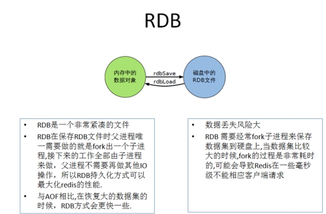

# 1、NoSQL数据库简介

## 1.1、技术发展

### 技术的分类
1. 解决功能性的问题：Java、Jsp、RDBMS、Tomcat、HTML、Linux、JDBC、SVN
2. 解决扩展性的问题：Struts、Spring、SpringMVC、Hibernate、Mybatis
3. 解决性能的问题：NoSQL、Java线程、Hadoop、Nginx、MQ、ElasticSearch

### Web1.0时代
数据访问量很有限，用一夫当关的高性能的单点服务器可以解决大部分问题。


### Web2.0时代
用户访问量大幅度提升，同时产生了大量的用户数据。加上后来的智能移动设备的普及，所有的互联网平台都面临了巨大的性能挑战。


### 解决CPU及内存压力


### 解决IO压力


## 1.2、NoSQL数据库概述

### NoSQL数据库概述
NoSQL(NoSQL = Not Only SQL)，意即“不仅仅是SQL”，泛指非关系型的数据库。
NoSQL 不依赖业务逻辑方式存储，而以简单的key-value模式存储。因此大大的增加了数据库的扩展能力。
- 不遵循SQL标准。
- 不支持ACID。
- 远超于SQL的性能。

### NoSQL适用场景
- 对数据高并发的读写
- 海量数据的读写
- 对数据高可扩展性的

### NoSQL不适用场景
- 需要事务支持
- 基于sql的结构化查询存储，处理复杂的关系,需要即席查询。
- （用不着sql的和用了sql也不行的情况，请考虑用NoSql）

### Memcache
- 很早出现的NoSql数据库
- 数据都在内存中，一般不持久化
- 支持简单的key-value模式，支持类型单一
- 一般是作为缓存数据库辅助持久化的数据库

### Redis
- 几乎覆盖了Memcached的绝大部分功能
- 数据都在内存中，支持持久化，主要用作备份恢复
- 除了支持简单的key-value模式，还支持多种数据结构的存储，比如list、set、hash、zset等。
- 一般是作为缓存数据库辅助持久化的数据库

### MongoDB
- 高性能、开源、模式自由(schema free)的文档型数据库
- 数据都在内存中， 如果内存不足，把不常用的数据保存到硬盘
- 虽然是key-value模式，但是对value（尤其是json）提供了丰富的查询功能
- 支持二进制数据及大型对象
- 可以根据数据的特点替代RDBMS，成为独立的数据库。或者配合RDBMS，存储特定的数据。


## 1.3、行式存储数据库

### 行式数据库


### 列式数据库


- Hbase
  - HBase是Hadoop项目中的数据库。它用于需要对大量的数据进行随机、实时的读写操作的场景中。
  - HBase的目标就是处理数据量非常庞大的表，可以用普通的计算机处理超过10亿行数据，还可处理有数百万列元素的数据表。
- Cassandra
  - Apache Cassandra是一款免费的开源NoSQL数据库，其设计目的在于管理由大量商用服务器构建起来的庞大集群上的海量数据集(数据量通常达到PB级别)。
  - 在众多显著特性当中，Cassandra最为卓越的长处是对写入及读取操作进行规模调整，而且其不强调主集群的设计思路能够以相对直观的方式简化各集群的创建与扩展流程。


## 1.4、图关系型数据库
主要应用：社会关系，公共交通网络，地图及网络拓谱 `(n*(n-1)/2)`


## 1.5、数据库排名
https://db-engines.com/en/ranking


# 2、Redis6概述和安装

## 2.1、Redis6概述
- Redis是一个开源的key-value存储系统。
- 和Memcached类似，它支持存储的value类型相对更多，包括string(字符串)、list(链表)、set(集合)、zset(sorted set --有序集合)和hash（哈希类型）。
- 这些数据类型都支持push/pop、add/remove及取交集并集和差集及更丰富的操作，而且这些操作都是原子性的。
- 在此基础上，Redis支持各种不同方式的排序。
- 与memcached一样，为了保证效率，数据都是缓存在内存中。
- 区别的是Redis会周期性的把更新的数据写入磁盘或者把修改操作写入追加的记录文件。
- 并且在此基础上实现了master-slave(主从)同步。

## 2.2、应用场景

### 配合关系型数据库做高速缓存
- 高频次，热门访问的数据，降低数据库IO
- 分布式架构，做session共享


### 多样的数据结构存储持久化数据


## 2.3、Redis6在Liunx系统安装

### 官网下载
- [Redis官方网站](http://redis.io)
- [Redis中文官方网站](http://redis.cn/)

### 编译安装
```sh
# [安装C语言的编译环境]
yum install centos-release-scl scl-utils-build
yum install -y devtoolset-8-toolchain
scl enable devtoolset-8 bash
# [测试gcc版本]
gcc --version
# 下载redis-6.2.1.tar.gz放/opt目录
tar -zxvf redis-6.2.1.tar.gz
cd redis-6.2.1
# 编译、安装，默认路径：/usr/local/bin
make
make install
```

错误
```sh
# 没有那个文件或目录: #include<jemalloc/jemalloc.h>
make distclean
```

### 安装目录：/usr/local/bin
- redis-benchmark：性能测试工具，可以在自己本子运行，看看自己本子性能如何
- redis-check-aof：修复有问题的AOF文件，rdb和aof后面讲
- redis-check-dump：修复有问题的dump.rdb文件
- redis-sentinel：Redis集群使用
- redis-server：Redis服务器启动命令
- redis-cli：客户端，操作入口

### 前台启动
命令行窗口不能关闭，否则服务器停止
```sh
redis-server
```

### 后台启动（推荐）
```sh
# [备份redis.conf（拷贝一份redis.conf到其他目录）也可以不备份]
cp /opt/redis-3.2.5/redis.conf /myredis
# 后台启动设置daemonize no改成yes
# 修改redis.conf(128行)文件将里面的daemonize no 改成yes，让服务在后台启动
# [Redis启动，指定配置文件路径]
redis-server /myredis/redis.conf
# [用客户端访问]
redis-cli
# [多实例指定端口]
redis-cli -p 6379
# [Redis关闭]
redis-cli shutdown
# [多实例指定端口关闭]
redis-cli -p 6379 shutdown
```

## 2.4、Redis介绍相关知识
端口6379从何而来【九键：Merz】

- 默认16个数据库，类似数组下标从0开始，初始默认使用0号库
- 使用命令 `select <dbid>` 来切换数据库。
- 统一密码管理，所有库同样密码。
- dbsize查看当前数据库的key的数量
- flushdb清空当前库
- flushall通杀全部库

### Redis是单线程+多路IO复用技术
多路复用是指使用一个线程来检查多个文件描述符（Socket）的就绪状态，比如调用select和poll函数，传入多个文件描述符，如果有一个文件描述符就绪，则返回，否则阻塞直到超时。
得到就绪状态后进行真正的操作可以在同一个线程里执行，也可以启动线程执行（比如使用线程池）

`串行` vs `多线程+锁(memcached)` vs `单线程+多路IO复用(Redis)`

与Memcache三点不同: 支持多数据类型，支持持久化，单线程+多路IO复用


# 3、常用五大数据类型
[redis常见数据类型操作命令](http://www.redis.cn/commands.html)


## 3.1、键(key)操作
| 命令         | 描述                                             |
| ------------ | ------------------------------------------------ |
| `keys *`     | 查看当前库所有key                                |
| exists key   | 判断某个key是否存在                              |
| type key     | 查看你的key是什么类型                            |
| del key      | 删除指定的key数据                                |
| unlink key   | 根据value选择非阻塞删除                          |
| expire key t | 给定的key设置过期时间：t秒后过期                 |
| ttl key      | 查看还有多少秒过期，-1表示永不过期，-2表示已过期 |
| select       | 命令切换数据库                                   |
| dbsize       | 查看当前数据库的key的数量                        |
| flushdb      | 清空当前库                                       |
| flushall     | 通杀全部库                                       |

非阻塞删除：仅将keys从keyspace元数据中删除，真正的删除会在后续异步操作。


## 3.2、Redis字符串(String)

### 简介
- String是Redis最基本的类型，你可以理解成与Memcached一模一样的类型，一个key对应一个value。
- String类型是二进制安全的。意味着Redis的string可以包含任何数据。比如jpg图片或者序列化的对象。
- String类型是Redis最基本的数据类型，一个Redis中字符串value最多可以是512M。

### 常用命令
| 命令                         | 描述                                   |
| ---------------------------- | -------------------------------------- |
| `set <key> <value>`          | 添加键值对                             |
| `get <key>`                  | 查询对应键值                           |
| `append <key> <value>`       | 将给定的 value 追加到原值的末尾        |
| `strlen <key>`               | 获得值的长度                           |
| `setnx <key> <value>`        | 只有在 key 不存在时设置 key 的值       |
| `incr <key>`                 | （原子操作）自增，如果为空，新增值为1  |
| `decr <key>`                 | （原子操作）自减，如果为空，新增值为-1 |
| `incrby/decrby <key> <步长>` | 同incr/decr。自定义步长。              |

注意：
- `set <key> <value> [EX s | PX ms] [NX | XX]`
  - NX: 当数据库中key不存在时，可以将key-value添加数据库
  - XX: 当数据库中key存在时，可以将key-value添加数据库，与NX参数互斥
  - EX: key的超时秒数
  - PX: key的超时毫秒数，与EX互斥
- incr、decr、incrby、decrby只能对数字值操作

### 原子性
所谓原子操作是指不会被线程调度机制打断的操作
这种操作一旦开始，就一直运行到结束，中间不会有任何 context switch （切换到另一个线程）。
1. 在单线程中，能够在单条指令中完成的操作都可以认为是"原子操作"，因为中断只能发生于指令之间。
2. 在多线程中，不能被其它进程（线程）打断的操作就叫原子操作。

Redis单命令的原子性主要得益于Redis的单线程。

| 命令                                   | 描述                                           |
| -------------------------------------- | ---------------------------------------------- |
| `mset <k1> <v1> <k2> <v2> ...`         | 同时设置一个或多个 key-value 对                |
| `mget <k1> <k2> <k3> ...`              | 同时获取一个或多个 value                       |
| `msetnx <k1> <v1> <k2> <v2> ...`       | 同setnx，同时设置一个或多个 key-value 对       |
| `getrange <key> <起始位置> <结束位置>` | 获得值的范围（substring），左闭右闭            |
| `setrange <key> <起始位置> <value>`    | 从起始位置开始，用value覆写key所储存的字符串值 |
| `setex <key> <过期时间> <value>`       | 设置键值的同时，设置过期时间，单位秒。         |
| `getset <key> <value>`                 | 以新换旧，设置了新值同时获得旧值。             |

注意：
- msetnx，如果多个key中有一个存在了，那么其他的值也不会被设置
  - 原子性：有一个失败则都失败
- 字符串索引从0开始

### 数据结构
String的数据结构为简单动态字符串(Simple Dynamic String,缩写SDS)。
是可以修改的字符串，内部结构实现上类似于Java的ArrayList，采用预分配冗余空间的方式来减少内存的频繁分配。

如图所示，内部为当前字符串实际分配的空间capacity一般要高于实际字符串长度len。
当字符串长度小于1M时，扩容都是加倍现有的空间，如果超过1M，扩容时一次只会多扩1M的空间。
注意：字符串最大长度为512M。


## 3.3、Redis列表(List)

### 简介
单键多值
- Redis 列表是简单的字符串列表，按照插入顺序排序。你可以添加一个元素到列表的头部（左边）或者尾部（右边）。
- 本质是个双向链表，对两端的操作性能很高，通过索引下标的操作中间的节点性能会较差。

### 常用命令
| 命令                                   | 描述                                        |
| -------------------------------------- | ------------------------------------------- |
| `lpush/rpush <k> <v1> <v2> <v3> ...`   | 从左边/右边插入一个或多个值。               |
| `lpop/rpop <key>`                      | 从左边/右边吐出一个值。值在键在，值光键亡。 |
| `rpoplpush <k1> <k2>`                  | 从k1列表右边吐出一个值，插到k2列表左边。    |
| `lrange <key> <start> <stop>`          | 按照索引下标获得元素(从左到右)              |
| `lindex <key> <index>`                 | 按照索引下标获得元素(从左到右)              |
| `llen <key>`                           | 获得列表长度                                |
| `linsert <key> before/after <v1> <v2>` | 在v1的前/后面插入v2                         |
| `lrem <key> <n> <value>`               | 从左边删除n个value(从左到右)                |
| `lset<key> <index> <value>`            | 将列表key下标为index的值替换成value         |

### 数据结构
List的数据结构为快速链表quickList。
首先在列表元素较少的情况下会使用一块连续的内存存储，这个结构是ziplist，也即是压缩列表。
它将所有的元素紧挨着一起存储，分配的是一块连续的内存。
当数据量比较多的时候才会改成quicklist。
因为普通的链表需要的附加指针空间太大，会比较浪费空间。
Redis将链表和ziplist结合起来组成了quicklist。也就是将多个ziplist使用双向指针串起来使用。这样既满足了快速的插入删除性能，又不会出现太大的空间冗余。


## 3.4、Redis集合(Set)

### 简介
Redis set对外提供的功能与list类似是一个列表的功能，特殊之处在于set是可以自动排重的，当你需要存储一个列表数据，又不希望出现重复数据时，set是一个很好的选择，并且set提供了判断某个成员是否在一个set集合内的重要接口，这个也是list所不能提供的。
Redis的Set是string类型的无序集合。它底层其实是一个value为null的hash表，所以添加，删除，查找的复杂度都是O(1)。
一个算法，随着数据的增加，执行时间的长短，如果是O(1)，数据增加，查找数据的时间不变。

### 常用命令
| 命令                         | 描述                                                |
| ---------------------------- | --------------------------------------------------- |
| `sadd <key> <v1> <v2> ...`   | 将一个或多个元素加入到集合key中，已经存在的将被忽略 |
| `smembers <key>`             | 取出该集合的所有值。                                |
| `sismember <key> <value>`    | 判断集合key是否为含有该value值，有1，没有0          |
| `scard <key>`                | 返回该集合的元素个数。                              |
| `srem <key> <v1> <v2> ...`   | 删除集合中的某个元素。                              |
| `spop <key>`                 | 随机从该集合中吐出一个值。                          |
| `srandmember <key> <n>`      | 随机从该集合中取出n个值。不会从集合中删除。         |
| `smove <src> <dest> <value>` | 把集合中一个值从一个集合移动到另一个集合            |
| `sinter <key1> <key2>`       | 返回两个集合的交集元素。                            |
| `sunion <key1> <key2>`       | 返回两个集合的并集元素。                            |
| `sdiff <key1> <key2>`        | 返回两个集合的差集元素(k1-k2)                       |

### 数据结构
Set数据结构是dict字典，字典是用哈希表实现的。
Java中HashSet的内部实现使用的是HashMap，只不过所有的value都指向同一个对象。Redis的set结构也是一样，它的内部也使用hash结构，所有的value都指向同一个内部值。


## 3.5、Redis哈希(Hash)

### 简介
Redis hash 是一个键值对集合。
Redis hash是一个string类型的field和value的映射表，hash特别适合用于存储对象。
类似Java里面的`Map<String, Object>`

用户ID为查找的key，存储的value用户对象包含姓名，年龄，生日等信息，如果用普通的key/value结构来存储
主要有以下2种存储方式：


### 常用命令
| 命令                                 | 描述                                            |
| ------------------------------------ | ----------------------------------------------- |
| `hset <key> <field> <value>`         | 给key集合中的field域赋值value                   |
| `hget <key> <field>`                 | 从key集合field取出value                         |
| `hmset <k1> <f1> <v1> <f2> <v2> ...` | 批量设置hash的值                                |
| `hexists <key> <field>`              | 查看哈希表key中，给定域field是否存在。          |
| `hkeys <key>`                        | 列出该hash集合的所有field                       |
| `hvals <key>`                        | 列出该hash集合的所有value                       |
| `hincrby <key> <field> <increment>`  | 为哈希表key中的域field的值加上增量              |
| `hsetnx <key> <field> <value>`       | 当且仅当域field不存在时，将field的值设置为value |

### 数据结构
Hash类型对应的数据结构是两种：ziplist（压缩列表），hashtable（哈希表）。当field-value长度较短且个数较少时，使用ziplist，否则使用hashtable。


## 3.6、Redis有序集合Zset

### 简介
Redis有序集合zset与普通集合set非常相似，是一个没有重复元素的字符串集合。
不同之处是有序集合的每个成员都关联了一个评分（score），按评分升序排序。集合成员唯一，评分可重复。
因为元素是有序的，所以你也可以很快的根据评分（score）或者次序（position）来获取一个范围的元素。
访问有序集合的中间元素也是非常快的，因此你能够使用有序集合作为一个没有重复成员的智能列表。

### 常用命令
| 命令                                                                   | 描述                                                                       |
| ---------------------------------------------------------------------- | -------------------------------------------------------------------------- |
| `zadd <key> <score1> <value1> <score2> <value2> ...`                   | 将一个或多个元素及其score值加入到有序集key中。                             |
| `zrange <key> <start> <stop> [withscores]`                             | 返回有序集key中，下标在start..stop之间的元素                               |
| `zrangebyscore <key> <min> <max> [withscores] [limit offset count]`    | 返回有序集key中，所有score值在[min, max]的成员。有序集成员按评分升序排列。 |
| `zrevrangebyscore <key> <max> <min> [withscores] [limit offset count]` | 同上，改为从大到小排列。                                                   |
| `zincrby <key> <increment> <value>`                                    | 为元素的score加上增量                                                      |
| `zrem <key> <value>`                                                   | 删除该集合下，指定值的元素                                                 |
| `zcount <key> <min> <max>`                                             | 统计该集合，分数区间内的元素个数                                           |
| `zrank <key> <value>`                                                  | 返回该值在集合中的排名，从0开始。                                          |

注：
- withscores：可以让分数一起和值返回到结果集。

### 数据结构
SortedSet(zset)是Redis提供的一个非常特别的数据结构
- 一方面它等价于Java的数据结构`Map<String, Double>`，可以给每一个元素value赋予一个权重score
- 另一方面它又类似于TreeSet，内部的元素会按照权重score进行排序，可以得到每个元素的名次，还可以通过score的范围来获取元素的列表。

zset底层使用了两个数据结构
- hash，hash的作用就是关联元素value和权重score，保障元素value的唯一性，可以通过元素value找到相应的score值。
- 跳跃表，跳跃表的目的在于给元素value排序，根据score的范围获取元素列表。

### 跳跃表（跳表）
有序集合在生活中比较常见，例如根据成绩对学生排名，根据得分对玩家排名等。
对于有序集合的底层实现，可以用数组、平衡树、链表等。
- 数组不便元素的插入、删除
- 平衡树或红黑树虽然效率高但结构复杂
- 链表查询需要遍历所有效率低
- 跳跃表效率堪比红黑树，实现远比红黑树简单。

对比有序链表和跳跃表，从链表中查询出51
- 有序链表 
- 跳跃表 


# 4、Redis6配置文件redis.conf详解

## 4.1、单位
配置大小单位，配置文件开头定义了一些基本的度量单位，只支持bytes，不支持bit。大小写不敏感
```conf
# Redis configuration file example.
#
# Note that in order to read the configuration file, Redis must be
# started with the file path as first argument:
#
# ./redis-server /path/to/redis.conf

# Note on units: when memory size is needed, it is possible to specify
# it in the usual form of 1k 5GB 4M and so forth:
#
# 1k => 1000 bytes
# 1kb => 1024 bytes
# 1m => 1000000 bytes
# 1mb => 1024*1024 bytes
# 1g => 1000000000 bytes
# 1gb => 1024*1024*1024 bytes
#
# units are case insensitive so 1GB 1Gb 1gB are all the same.
```


## 4.2、包含
```conf
################################## INCLUDES ###################################

# Include one or more other config files here.  This is useful if you
# have a standard template that goes to all Redis servers but also need
# to customize a few per-server settings.  Include files can include
# other files, so use this wisely.
#
# Note that option "include" won't be rewritten by command "CONFIG REWRITE"
# from admin or Redis Sentinel. Since Redis always uses the last processed
# line as value of a configuration directive, you'd better put includes
# at the beginning of this file to avoid overwriting config change at runtime.
#
# If instead you are interested in using includes to override configuration
# options, it is better to use include as the last line.
#
# include /path/to/local.conf
# include /path/to/other.conf
```
类似jsp中的include，多实例的情况可以把公用的配置文件提取出来


## 4.3、网络相关

### bind
默认情况 `bind 127.0.0.1 -::1` 只能接受本机的访问请求
不写的情况下，无限制接受任何ip地址的访问
生产环境肯定要写你应用服务器的地址；服务器是需要远程访问的，所以需要将其注释掉
```conf
################################## NETWORK #####################################

# By default, if no "bind" configuration directive is specified, Redis listens
# for connections from all available network interfaces on the host machine.
# It is possible to listen to just one or multiple selected interfaces using
# the "bind" configuration directive, followed by one or more IP addresses.
# Each address can be prefixed by "-", which means that redis will not fail to
# start if the address is not available. Being not available only refers to
# addresses that does not correspond to any network interfece. Addresses that
# are already in use will always fail, and unsupported protocols will always BE
# silently skipped.
#
# Examples:
#
# bind 192.168.1.100 10.0.0.1     # listens on two specific IPv4 addresses
# bind 127.0.0.1 ::1              # listens on loopback IPv4 and IPv6
# bind * -::*                     # like the default, all available interfaces
#
# ~~~ WARNING ~~~ If the computer running Redis is directly exposed to the
# internet, binding to all the interfaces is dangerous and will expose the
# instance to everybody on the internet. So by default we uncomment the
# following bind directive, that will force Redis to listen only on the
# IPv4 and IPv6 (if available) loopback interface addresses (this means Redis
# will only be able to accept client connections from the same host that it is
# running on).
#
# IF YOU ARE SURE YOU WANT YOUR INSTANCE TO LISTEN TO ALL THE INTERFACES
# JUST COMMENT OUT THE FOLLOWING LINE.
# ~~~~~~~~~~~~~~~~~~~~~~~~~~~~~~~~~~~~~~~~~~~~~~~~~~~~~~~~~~~~~~~~~~~~~~~~
bind 127.0.0.1 -::1
```

### protected-mode
如果开启了protected-mode，那么在没有设定bind ip且没有设密码的情况下，Redis只允许接受本机的响应
将本机访问保护模式设置no
保存配置，停止服务，重启启动查看进程，不再是本机访问了。
```conf
# Protected mode is a layer of security protection, in order to avoid that
# Redis instances left open on the internet are accessed and exploited.
#
# When protected mode is on and if:
#
# 1) The server is not binding explicitly to a set of addresses using the
#    "bind" directive.
# 2) No password is configured.
#
# The server only accepts connections from clients connecting from the
# IPv4 and IPv6 loopback addresses 127.0.0.1 and ::1, and from Unix domain
# sockets.
#
# By default protected mode is enabled. You should disable it only if
# you are sure you want clients from other hosts to connect to Redis
# even if no authentication is configured, nor a specific set of interfaces
# are explicitly listed using the "bind" directive.
protected-mode yes
```

### port
端口号，默认 6379
```conf
# Accept connections on the specified port, default is 6379 (IANA #815344).
# If port 0 is specified Redis will not listen on a TCP socket.
port 6379
```

### tcp-backlog
设置tcp的backlog，backlog其实是一个连接队列，backlog队列总和=未完成三次握手队列 + 已经完成三次握手队列。
在高并发环境下你需要一个高backlog值来避免慢客户端连接问题。
注意Linux内核会将这个值减小到/proc/sys/net/core/somaxconn的值（128），所以需要确认增大/proc/sys/net/core/somaxconn和/proc/sys/net/ipv4/tcp_max_syn_backlog（128）两个值来达到想要的效果
```conf
# TCP listen() backlog.
#
# In high requests-per-second environments you need a high backlog in order
# to avoid slow clients connection issues. Note that the Linux kernel
# will silently truncate it to the value of /proc/sys/net/core/somaxconn so
# make sure to raise both the value of somaxconn and tcp_max_syn_backlog
# in order to get the desired effect.
tcp-backlog 511
```

### timeout
一个空闲的客户端维持多少秒会关闭，0表示关闭该功能。即永不关闭。
```conf
# Unix socket.
#
# Specify the path for the Unix socket that will be used to listen for
# incoming connections. There is no default, so Redis will not listen
# on a unix socket when not specified.
#
# unixsocket /run/redis.sock
# unixsocketperm 700

# Close the connection after a client is idle for N seconds (0 to disable)
timeout 0
```

### tcp-keepalive
对访问客户端的一种心跳检测，每个n秒检测一次。
单位为秒，如果设置为0，则不会进行Keepalive检测，建议设置成60 
```conf
# TCP keepalive.
#
# If non-zero, use SO_KEEPALIVE to send TCP ACKs to clients in absence
# of communication. This is useful for two reasons:
#
# 1) Detect dead peers.
# 2) Force network equipment in the middle to consider the connection to be
#    alive.
#
# On Linux, the specified value (in seconds) is the period used to send ACKs.
# Note that to close the connection the double of the time is needed.
# On other kernels the period depends on the kernel configuration.
#
# A reasonable value for this option is 300 seconds, which is the new
# Redis default starting with Redis 3.2.1.
tcp-keepalive 300
```


## 4.4、通用

### daemonize
是否为后台进程，设置为yes
守护进程，后台启动
```conf
################################# GENERAL #####################################

# By default Redis does not run as a daemon. Use 'yes' if you need it.
# Note that Redis will write a pid file in /var/run/redis.pid when daemonized.
# When Redis is supervised by upstart or systemd, this parameter has no impact.
daemonize no
```

### pidfile
存放pid文件的位置，每个实例会产生一个不同的pid文件
```conf
# If a pid file is specified, Redis writes it where specified at startup
# and removes it at exit.
#
# When the server runs non daemonized, no pid file is created if none is
# specified in the configuration. When the server is daemonized, the pid file
# is used even if not specified, defaulting to "/var/run/redis.pid".
#
# Creating a pid file is best effort: if Redis is not able to create it
# nothing bad happens, the server will start and run normally.
#
# Note that on modern Linux systems "/run/redis.pid" is more conforming
# and should be used instead.
pidfile /var/run/redis_6379.pid
```

### loglevel
指定日志记录级别，Redis总共支持四个级别：debug、verbose、notice、warning，默认为notice
四个级别根据使用阶段来选择，生产环境选择notice或者warning
```conf
# Specify the server verbosity level.
# This can be one of:
# debug (a lot of information, useful for development/testing)
# verbose (many rarely useful info, but not a mess like the debug level)
# notice (moderately verbose, what you want in production probably)
# warning (only very important / critical messages are logged)
loglevel notice
```

### logfile
日志文件名称
```conf
# Specify the log file name. Also the empty string can be used to force
# Redis to log on the standard output. Note that if you use standard
# output for logging but daemonize, logs will be sent to /dev/null
logfile ""
```

### databases
设定库的数量 默认16，默认数据库为0，可以使用`SELECT <dbid>`命令在连接上指定数据库id
```conf
# Set the number of databases. The default database is DB 0, you can select
# a different one on a per-connection basis using SELECT <dbid> where
# dbid is a number between 0 and 'databases'-1
databases 16
```


## 4.5、安全

### requirepass
访问密码的查看、设置和取消
```conf
# IMPORTANT NOTE: starting with Redis 6 "requirepass" is just a compatibility
# layer on top of the new ACL system. The option effect will be just setting
# the password for the default user. Clients will still authenticate using
# AUTH <password> as usually, or more explicitly with AUTH default <password>
# if they follow the new protocol: both will work.
#
# The requirepass is not compatable with aclfile option and the ACL LOAD
# command, these will cause requirepass to be ignored.
#
# requirepass foobared
```

临时设置：在命令中设置。重启redis服务器，密码就还原了。
```sh
config set requirepass <password>
```

永久设置：在配置文件中进行设置。


## 4.6、限制

### maxclients
- 设置redis同时可以与多少个客户端进行连接。
- 默认情况下为10000个客户端。
- 如果达到了此限制，redis则会拒绝新的连接请求，并且向这些连接请求方发出“max number of clients reached”以作回应。

```conf
# Set the max number of connected clients at the same time. By default
# this limit is set to 10000 clients, however if the Redis server is not
# able to configure the process file limit to allow for the specified limit
# the max number of allowed clients is set to the current file limit
# minus 32 (as Redis reserves a few file descriptors for internal uses).
#
# Once the limit is reached Redis will close all the new connections sending
# an error 'max number of clients reached'.
#
# IMPORTANT: When Redis Cluster is used, the max number of connections is also
# shared with the cluster bus: every node in the cluster will use two
# connections, one incoming and another outgoing. It is important to size the
# limit accordingly in case of very large clusters.
#
# maxclients 10000
```

### maxmemory
- 建议必须设置，否则，将内存占满，造成服务器宕机
- 设置redis可以使用的内存量。一旦到达内存使用上限，redis将会试图移除内部数据，移除规则可以通过maxmemory-policy来指定。
- 如果redis无法根据移除规则来移除内存中的数据，或者设置了“不允许移除”，那么redis则会针对那些需要申请内存的指令返回错误信息，比如SET、LPUSH等。
- 但是对于无内存申请的指令，仍然会正常响应，比如GET等。如果你的redis是主redis（说明你的redis有从redis），那么在设置内存使用上限时，需要在系统中留出一些内存空间给同步队列缓存，只有在你设置的是“不移除”的情况下，才不用考虑这个因素。

```conf
# Set a memory usage limit to the specified amount of bytes.
# When the memory limit is reached Redis will try to remove keys
# according to the eviction policy selected (see maxmemory-policy).
#
# If Redis can't remove keys according to the policy, or if the policy is
# set to 'noeviction', Redis will start to reply with errors to commands
# that would use more memory, like SET, LPUSH, and so on, and will continue
# to reply to read-only commands like GET.
#
# This option is usually useful when using Redis as an LRU or LFU cache, or to
# set a hard memory limit for an instance (using the 'noeviction' policy).
#
# WARNING: If you have replicas attached to an instance with maxmemory on,
# the size of the output buffers needed to feed the replicas are subtracted
# from the used memory count, so that network problems / resyncs will
# not trigger a loop where keys are evicted, and in turn the output
# buffer of replicas is full with DELs of keys evicted triggering the deletion
# of more keys, and so forth until the database is completely emptied.
#
# In short... if you have replicas attached it is suggested that you set a lower
# limit for maxmemory so that there is some free RAM on the system for replica
# output buffers (but this is not needed if the policy is 'noeviction').
#
# maxmemory <bytes>
```

### maxmemory-policy
- volatile-lru：使用LRU算法移除key，只对设置了过期时间的键；（最近最少使用）
- allkeys-lru：在所有集合key中，使用LRU算法移除key
- volatile-random：在过期集合中移除随机的key，只对设置了过期时间的键
- allkeys-random：在所有集合key中，移除随机的key
- volatile-ttl：移除那些TTL值最小的key，即那些最近要过期的key
- noeviction：不进行移除。针对写操作，只是返回错误信息
```conf
# MAXMEMORY POLICY: how Redis will select what to remove when maxmemory
# is reached. You can select one from the following behaviors:
#
# volatile-lru -> Evict using approximated LRU, only keys with an expire set.
# allkeys-lru -> Evict any key using approximated LRU.
# volatile-lfu -> Evict using approximated LFU, only keys with an expire set.
# allkeys-lfu -> Evict any key using approximated LFU.
# volatile-random -> Remove a random key having an expire set.
# allkeys-random -> Remove a random key, any key.
# volatile-ttl -> Remove the key with the nearest expire time (minor TTL)
# noeviction -> Don't evict anything, just return an error on write operations.
#
# LRU means Least Recently Used
# LFU means Least Frequently Used
#
# Both LRU, LFU and volatile-ttl are implemented using approximated
# randomized algorithms.
#
# Note: with any of the above policies, when there are no suitable keys for
# eviction, Redis will return an error on write operations that require
# more memory. These are usually commands that create new keys, add data or
# modify existing keys. A few examples are: SET, INCR, HSET, LPUSH, SUNIONSTORE,
# SORT (due to the STORE argument), and EXEC (if the transaction includes any
# command that requires memory).
#
# The default is:
#
# maxmemory-policy noeviction
```

### maxmemory-samples
- 设置样本数量，LRU算法和最小TTL算法都并非是精确的算法，而是估算值，所以你可以设置样本的大小，redis默认会检查这么多个key并选择其中LRU的那个。
- 一般设置3到7的数字，数值越小样本越不准确，但性能消耗越小。

```conf
# LRU, LFU and minimal TTL algorithms are not precise algorithms but approximated
# algorithms (in order to save memory), so you can tune it for speed or
# accuracy. By default Redis will check five keys and pick the one that was
# used least recently, you can change the sample size using the following
# configuration directive.
#
# The default of 5 produces good enough results. 10 Approximates very closely
# true LRU but costs more CPU. 3 is faster but not very accurate.
#
# maxmemory-samples 5
```


# 5、Redis6的发布和订阅

## 5.1、什么是发布和订阅
Redis 发布订阅 (pub/sub) 是一种消息通信模式：发送者 (pub) 发送消息，订阅者 (sub) 接收消息。

Redis 客户端可以订阅任意数量的频道。


## 5.2、Redis的发布和订阅
1、客户端可以订阅频道如下图


2、当给这个频道发布消息后，消息就会发送给订阅的客户端


## 5.3、发布订阅命令行实现
1、打开一个客户端订阅channel1
```
SUBSCRIBE channel1
```

2、打开另一个客户端，给channel1发布消息hello，返回订阅者数量
```
publish channel1 hello
```

3、打开第一个客户端可以看到发送的消息

注：发布的消息没有持久化，如果在订阅的客户端收不到hello，只能收到订阅后发布的消息


# 6、Redis6新数据类型

## 6.1、Bitmaps

### 简介
现代计算机用二进制（位）作为信息的基础单位，1个字节等于8位。
例如“abc”字符串是由3个字节组成，但实际在计算机存储时将其用二进制表示，“abc”分别对应的ASCII码分别是97、98、99，对应的二进制分别是01100001、01100010和01100011，如下图


合理地使用操作位能够有效地提高内存使用率和开发效率。

Redis提供了Bitmaps这个“数据类型”可以实现对位的操作：
1. Bitmaps本身不是一种数据类型，实际上它就是字符串（key-value），但是它可以对字符串的位进行操作。
2. Bitmaps单独提供了一套命令，所以在Redis中使用Bitmaps和使用字符串的方法不太相同。可以把Bitmaps想象成一个以位为单位的数组，数组的每个单元只能存储0和1，数组的下标在Bitmaps中叫做偏移量。

### 命令
| 命令                                   | 描述                                                    |
| -------------------------------------- | ------------------------------------------------------- |
| `setbit <key> <offset> <value>`        | 设置Bitmaps中某个偏移量的值（0或1）                     |
| `getbit <key> <offset>`                | 获取Bitmaps中某个偏移量的值，不存在返回0                |
| `bitcount <key> [start end]`           | 统计字符串从start字节到end字节比特值为1的数量           |
| `bitop <operation> <destkey> [key...]` | 对多个Bitmaps进行operation操作并将结果保存在destkey中。 |

注：
- Bitmaps中的偏移量从0开始
- 案例：
  - 每个独立用户是否访问过网站存放在Bitmaps中，将访问的用户记做1，没有访问的用户记做0，用偏移量作为用户的id。
  - 很多应用的用户id以一个指定数字（例如10000）开头，直接将用户id和Bitmaps的偏移量对应势必会造成一定的浪费，通常的做法是每次做setbit操作时将用户id减去这个指定数字。
- 在第一次初始化Bitmaps时，假如偏移量非常大，那么整个初始化过程执行会比较慢，可能会造成Redis的阻塞。
- bitcount：统计字符串被设置为1的bit数。
  - 一般情况下，给定的整个字符串都会被进行计数，通过指定额外的 start 或 end 参数，可以让计数只在特定的位上进行。
  - start 和 end 参数的设置，都可以使用负数值：比如 -1 表示最后一个位，而 -2 表示倒数第二个位
  - start、end 是指bit组的字节的下标数，左闭右闭。
  - setbit设置或清除的是bit位置，而bitcount计算的是byte位置。
- operation：and（交集）、or（并集）、not（非）、xor（异或）

### Bitmaps与set对比
假设网站有1亿用户，每天独立访问的用户有5千万，如果每天用集合类型和Bitmaps分别存储活跃用户可以得到表

set和Bitmaps存储一天活跃用户对比
| 数据类型 | 每个用户id占用空间 | 需要存储的用户量 | 全部内存量             |
| -------- | ------------------ | ---------------- | ---------------------- |
| 集合类型 | 64位               | 50000000         | 64位*50000000 = 400MB  |
| Bitmaps  | 1位                | 100000000        | 1位*100000000 = 12.5MB |

很明显，这种情况下使用Bitmaps能节省很多的内存空间，尤其是随着时间推移节省的内存还是非常可观的

set和Bitmaps存储独立用户空间对比
| 数据类型 | 一天   | 一个月 | 一年  |
| -------- | ------ | ------ | ----- |
| 集合类型 | 400MB  | 12GB   | 144GB |
| Bitmaps  | 12.5MB | 375MB  | 4.5GB |

但Bitmaps并不是万金油，假如该网站每天的独立访问用户很少，例如只有10万（大量的僵尸用户），那么两者的对比如下表所示，很显然，这时候使用Bitmaps就不太合适了，因为基本上大部分位都是0。

set和Bitmaps存储一天活跃用户对比（独立用户比较少）
| 数据类型 | 每个userid占用空间 | 需要存储的用户量 | 全部内存量             |
| -------- | ------------------ | ---------------- | ---------------------- |
| 集合类型 | 64位               | 100000           | 64位*100000 = 800KB    |
| Bitmaps  | 1位                | 100000000        | 1位*100000000 = 12.5MB |


## 6.2、HyperLogLog

### 简介
在工作当中，我们经常会遇到与统计相关的功能需求，比如统计网站PV（PageView页面访问量），可以使用Redis的incr、incrby轻松实现。
基数问题：求集合中不重复元素个数的问题，如：UV（UniqueVisitor，独立访客）、独立IP数、搜索记录数等需要去重和计数的问题

解决基数问题有很多种方案：
1. 数据存储在MySQL表中，使用distinct count计算不重复个数
2. 使用Redis提供的hash、set、bitmaps等数据结构来处理

以上的方案结果精确，但随着数据不断增加，导致占用空间越来越大，对于非常大的数据集是不切实际的。
- 基数估计：在误差可接受的范围内，快速计算基数。
- 降低一定的精度平衡存储空间

Redis HyperLogLog 是用来做基数统计的算法，HyperLogLog 的优点是，在输入元素的数量或者体积非常非常大时，计算基数所需的空间总是固定的、并且是很小的。
在 Redis 里面，每个 HyperLogLog 键只需要花费 12 KB 内存，就可以计算接近 2^64 个不同元素的基数。这和计算基数时，元素越多耗费内存就越多的集合形成鲜明对比。
但是，因为 HyperLogLog 只会根据输入元素来计算基数，而不会储存输入元素本身，所以 HyperLogLog 不能像集合那样，返回输入的各个元素。

### 命令
| 命令                                            | 描述                                         |
| ----------------------------------------------- | -------------------------------------------- |
| `pfadd <key> <element> [element ...]`           | 添加指定元素到 HyperLogLog 中                |
| `pfcount <key> [key ...]`                       | 计算多个HLL的近似基数                        |
| `pfmerge <destkey> <sourcekey> [sourcekey ...]` | 将一个或多个HLL合并后的结果存储在另一个HLL中 |

- pfadd：将所有元素添加到指定HyperLogLog数据结构中。如果执行命令后HLL估计的近似基数发生变化，则返回1，否则返回0。
- pfcount：用HLL存储每天的UV，计算一周的UV可以使用7天的UV合并计算即可
- pfmerge：将一个或多个HLL合并后的结果存储在另一个HLL中，比如每月活跃用户可以使用每天的活跃用户来合并计算可得


## 6.3、Geospatial

### 简介
Redis 3.2 中增加了对GEO（Geographic）类型的支持。该类型，就是元素的2维坐标，在地图上就是经纬度。
redis基于该类型，提供了经纬度设置，查询，范围查询，距离查询，经纬度Hash等常见操作。

### 命令
| 命令                                              | 描述                                       |
| ------------------------------------------------- | ------------------------------------------ |
| `geoadd <key> <longitude> <latitude> <member>`    | 添加一个或多个地理位置（经度，纬度，名称） |
| `geopos <key> <member> [member...]`               | 获得指定地区的坐标值                       |
| `geodist <key> <member1> <member2>`               | 获取两个位置之间的直线距离                 |
| `georadius <key> <longitude> <latitude> <radius>` | 以给定的经纬度为中心，找出某一半径内的元素 |

```
geoadd china:city 121.47 31.23 shanghai
geoadd china:city 106.50 29.53 chongqing 114.05 22.52 shenzhen 116.38 39.90 beijing
```
两极无法直接添加，一般会下载城市数据，直接通过 Java 程序一次性导入。
有效的经度从 -180 度到 180 度。有效的纬度从 -85.05112878 度到 85.05112878 度。
当坐标位置超出指定范围时，该命令将会返回一个错误。
已经添加的数据，是无法再次往里面添加的。

`geodist <key> <member1> <member2> [m|km|mi|ft]`
- m 表示单位为米【默认】
- km 表示单位为千米
- mi 表示单位为英里
- ft 表示单位为英尺

`georadius <key> <longitude> <latitude> <radius> [m|km|mi|ft]`


# 7、Jedis操作Redis6

## 7.0、依赖
```xml
<dependency>
  <groupId>redis.clients</groupId>
  <artifactId>jedis</artifactId>
  <version>3.2.0</version>
</dependency>
```

连接Redis注意事项：
- 禁用Linux的防火墙：Linux(CentOS7)里执行命令
- systemctl stop/disable firewalld.service
- redis.conf中注释掉bind 127.0.0.1，设置protected-mode为no


## 7.1、Jedis常用操作
```java
// 创建Jedis对象
Jedis jedis = new Jedis("192.168.44.168", 6379);
// 测试连接，成功返回PONG
String value = jedis.ping();
// 操作key string
jedis.set("name", "lucy"); // 添加
String name = jedis.get("name"); // 获取
jedis.mset("k1", "v1", "k2", "v2"); // 设置多个key-value
List<String> mget = jedis.mget("k1", "k2"); // 获取多个key-value
Set<String> keys = jedis.keys("*");// 获取所有键
// 操作list
jedis.lpush("key1", "lucy", "mary", "jack");
List<String> values = jedis.lrange("key1", 0, -1);
// 操作set
jedis.sadd("names", "lucy");
jedis.sadd("names", "mary");
Set<String> names = jedis.smembers("names");
// 操作hash
jedis.hset("users", "age", "20");
String hget = jedis.hget("users", "age");
// 操作zset
jedis.zadd("china", 100d, "shanghai");
Set<String> china = jedis.zrange("china", 0, -1);
// 关闭连接
jedis.close();
```


## 7.2、Jedis实例-模拟验证码发送


```java
public static void main(String[] args) {
    // 模拟验证码发送
    verifyCode("13678765435");
    // 模拟验证码校验
    getRedisCode("13678765435", "4444");
}

// 3 验证码校验
public static void getRedisCode(String phone, String code) {
    // 从redis获取验证码
    Jedis jedis = new Jedis("192.168.44.168", 6379);
    // 验证码key
    String codeKey = "VerifyCode" + phone + ":code";
    String redisCode = jedis.get(codeKey);
    // 判断
    if (redisCode.equals(code)) {
        System.out.println("成功");
    } else {
        System.out.println("失败");
    }
    jedis.close();
}

// 2 每个手机每天只能发送三次，验证码放到redis中，设置过期时间120
public static void verifyCode(String phone) {
    // 连接redis
    Jedis jedis = new Jedis("192.168.44.168", 6379);

    // 拼接key
    // 手机发送次数key
    String countKey = "VerifyCode" + phone + ":count";
    // 验证码key
    String codeKey = "VerifyCode" + phone + ":code";

    // 每个手机每天只能发送三次
    String count = jedis.get(countKey);
    if (count == null) {
        // 没有发送次数，第一次发送
        // 设置发送次数是1
        jedis.setex(countKey, 24 * 60 * 60, "1");
    } else if (Integer.parseInt(count) <= 2) {
        // 发送次数+1
        jedis.incr(countKey);
    } else if (Integer.parseInt(count) > 2) {
        // 发送三次，不能再发送
        System.out.println("今天发送次数已经超过三次");
        jedis.close();
        return;
    }

    // 发送验证码放到redis里面
    String vcode = getCode();
    jedis.setex(codeKey, 120, vcode);
    jedis.close();
}

// 1 生成6位数字验证码
public static String getCode() {
    Random random = new Random();
    String code = "";
    for (int i = 0; i < 6; i++) {
        int rand = random.nextInt(10);
        code += rand;
    }
    return code;
}
```


# 8、Redis6与Spring Boot整合

## 1、在pom.xml文件中引入redis相关依赖
```xml
<!-- redis -->
<dependency>
    <groupId>org.springframework.boot</groupId>
    <artifactId>spring-boot-starter-data-redis</artifactId>
</dependency>

<!-- spring2.X集成redis所需common-pool2-->
<dependency>
    <groupId>org.apache.commons</groupId>
    <artifactId>commons-pool2</artifactId>
    <version>2.6.0</version>
</dependency>
```


## 2、application.properties配置redis配置
```properties
#Redis服务器地址
spring.redis.host=192.168.44.168
#Redis服务器连接端口
spring.redis.port=6379
#Redis数据库索引（默认为0）
spring.redis.database=0
#连接超时时间（毫秒）
spring.redis.timeout=1800000
#连接池最大连接数（使用负值表示没有限制）
spring.redis.lettuce.pool.max-active=20
#最大阻塞等待时间(负数表示没限制)
spring.redis.lettuce.pool.max-wait=-1
#连接池中的最大空闲连接
spring.redis.lettuce.pool.max-idle=5
#连接池中的最小空闲连接
spring.redis.lettuce.pool.min-idle=0
```


## 3、添加redis配置类
```java
@EnableCaching
@Configuration
public class RedisConfig extends CachingConfigurerSupport {

    @Bean
    public RedisTemplate<String, Object> redisTemplate(RedisConnectionFactory factory) {
        RedisTemplate<String, Object> template = new RedisTemplate<>();
        RedisSerializer<String> redisSerializer = new StringRedisSerializer();
        Jackson2JsonRedisSerializer jackson2JsonRedisSerializer = new Jackson2JsonRedisSerializer(Object.class);
        ObjectMapper om = new ObjectMapper();
        om.setVisibility(PropertyAccessor.ALL, JsonAutoDetect.Visibility.ANY);
        om.enableDefaultTyping(ObjectMapper.DefaultTyping.NON_FINAL);
        jackson2JsonRedisSerializer.setObjectMapper(om);
        template.setConnectionFactory(factory);
        // key序列化方式
        template.setKeySerializer(redisSerializer);
        // value序列化
        template.setValueSerializer(jackson2JsonRedisSerializer);
        // value hashmap序列化
        template.setHashValueSerializer(jackson2JsonRedisSerializer);
        return template;
    }

    @Bean
    public CacheManager cacheManager(RedisConnectionFactory factory) {
        RedisSerializer<String> redisSerializer = new StringRedisSerializer();
        Jackson2JsonRedisSerializer jackson2JsonRedisSerializer = new Jackson2JsonRedisSerializer(Object.class);
        // 解决查询缓存转换异常的问题
        ObjectMapper om = new ObjectMapper();
        om.setVisibility(PropertyAccessor.ALL, JsonAutoDetect.Visibility.ANY);
        om.enableDefaultTyping(ObjectMapper.DefaultTyping.NON_FINAL);
        jackson2JsonRedisSerializer.setObjectMapper(om);
        // 配置序列化（解决乱码的问题）,过期时间600秒
        RedisCacheConfiguration config = RedisCacheConfiguration.defaultCacheConfig()
                .entryTtl(Duration.ofSeconds(600))
                .serializeKeysWith(RedisSerializationContext.SerializationPair
                        .fromSerializer(redisSerializer))
                .serializeValuesWith(RedisSerializationContext.SerializationPair
                        .fromSerializer(jackson2JsonRedisSerializer))
                .disableCachingNullValues();
        RedisCacheManager cacheManager = RedisCacheManager.builder(factory)
                .cacheDefaults(config)
                .build();
        return cacheManager;
    }
}
```


## 4、测试
```java
// 设置值到redis
redisTemplate.opsForValue().set("name", "lucy");
// 从redis获取值
String name = (String) redisTemplate.opsForValue().get("name");
```


# 9、Redis6的事务操作

## 9.1、Redis的事务定义
Redis事务是一个单独的隔离操作：事务中的所有命令都会序列化、按顺序地执行。
事务在执行的过程中，不会被其他客户端发送来的命令请求所打断。
Redis事务的主要作用就是串联多个命令防止别的命令插队。


## 9.2、事务操作Multi、Exec、discard
从输入Multi命令开始，输入的命令都会依次进入命令队列中，但不会执行，直到输入Exec后，Redis会将之前的命令队列中的命令依次执行。
组队的过程中可以通过discard来放弃组队。


三种情况
- 组队成功，提交成功
- 组队阶段报错，提交失败
- 组队成功，提交有成功有失败


## 9.3、事务的错误处理
组队中某个命令出现了报告错误，执行时整个的所有队列都会被取消。


如果执行阶段某个命令报出了错误，则只有报错的命令不会被执行，而其他的命令都会执行，不会回滚。


## 9.4、事务冲突的问题（乐观锁和悲观锁）


### 悲观锁(Pessimistic Lock)

每次去拿数据的时候都认为别人会修改，所以每次在拿数据的时候都会上锁，这样别人想拿这个数据就会block直到它拿到锁。
传统的关系型数据库里边就用到了很多这种锁机制，比如行锁，表锁等，读锁，写锁等，都是在做操作之前先上锁。

### 乐观锁(Optimistic Lock)

每次去拿数据的时候都认为别人不会修改，所以不会上锁，但是在更新的时候会判断一下在此期间别人有没有去更新这个数据，可以使用版本号等机制。
乐观锁适用于多读的应用类型，这样可以提高吞吐量。Redis就是利用这种check-and-set机制实现事务的。

### WATCH key [key ...]
在执行multi之前，先执行 `watch key1 [key2]`，可以监视一个(或多个)key，
如果在事务执行之前这个(或这些)key被其他命令所改动，那么事务将被打断。
```sh
watch balance
multi
incrby balance 10 # 如果balance被修改过则返回(nil)
```
 
### unwatch
取消WATCH命令对所有key的监视。
如果在执行WATCH命令之后，EXEC命令或DISCARD命令先被执行了的话，那么就不需要再执行UNWATCH了。
[Redis 命令参考 » Transaction（事务） » EXEC](http://doc.redisfans.com/transaction/exec.html)


## 9.5、Redis事务三特性
- 单独的隔离操作 
  - 事务中的所有命令都会序列化、按顺序地执行。事务在执行的过程中，不会被其他客户端发送来的命令请求所打断。 
- 没有隔离级别的概念 
  - 队列中的命令没有提交之前都不会实际被执行，因为事务提交前任何指令都不会被实际执行
- 不保证原子性 
  - 事务中如果有一条命令执行失败，其后的命令仍然会被执行，没有回滚 


## 9.6、Redis事务案例-商品秒杀案例


### 页面及Servlet
```jsp
<%@ page language="java" contentType="text/html; charset=UTF-8" pageEncoding="UTF-8" %>
<!DOCTYPE html PUBLIC "-//W3C//DTD HTML 4.01 Transitional//EN" "http://www.w3.org/TR/html4/loose.dtd">
<html>
<head>
    <meta http-equiv="Content-Type" content="text/html; charset=UTF-8">
    <title>Insert title here</title>
</head>
<body>
    <h1>iPhone 13 Pro !!! 1元秒杀！！！
    </h1>
    <form id="msform" action="${pageContext.request.contextPath}/doseckill"
        enctype="application/x-www-form-urlencoded">
        <input type="hidden" id="prodid" name="prodid" value="0101">
        <input type="button" id="miaosha_btn" name="seckill_btn" value="秒杀点我" />
    </form>
</body>
<script type="text/javascript" src="${pageContext.request.contextPath}/script/jquery/jquery-3.1.0.js"></script>
<script type="text/javascript">
    $(function () {
        $("#miaosha_btn").click(function () {
            var url = $("#msform").attr("action");
            $.post(url, $("#msform").serialize(), function (data) {
                if (data == "false") {
                    alert("抢光了");
                    $("#miaosha_btn").attr("disabled", true);
                }
            });
        })
    })
</script>
</html>
```

```java
public class SecKillServlet extends HttpServlet {
    private static final long serialVersionUID = 1L;

    public SecKillServlet() {
        super();
    }

    protected void doPost(HttpServletRequest request, HttpServletResponse response)
            throws ServletException, IOException {

        String userid = new Random().nextInt(50000) + "";
        String prodid = request.getParameter("prodid");

        // boolean isSuccess = SecKill_redis.doSecKill(userid,prodid);
        boolean isSuccess = SecKill_redisByScript.doSecKill(userid, prodid);
        response.getWriter().print(isSuccess);
    }
}
```

### 秒杀并发模拟
使用工具ab模拟测试
```sh
yum install httpd-tools
```

操作详见： `ab --help`

### 通过连接池解决【连接超时问题】
节省每次连接redis服务带来的消耗，把连接好的实例反复利用。
通过参数管理连接的行为

链接池参数
- MaxTotal：控制一个pool可分配多少个jedis实例，通过pool.getResource()来获取；如果赋值为-1，则表示不限制；如果pool已经分配了MaxTotal个jedis实例，则此时pool的状态为exhausted。
- maxIdle：控制一个pool最多有多少个状态为idle(空闲)的jedis实例；
- MaxWaitMillis：表示当borrow一个jedis实例时，最大的等待毫秒数，如果超过等待时间，则直接抛JedisConnectionException；
- testOnBorrow：获得一个jedis实例的时候是否检查连接可用性（ping()）；如果为true，则得到的jedis实例均是可用的；

```java
public class JedisPoolUtil {
    private static volatile JedisPool jedisPool = null;

    private JedisPoolUtil() {
    }

    public static JedisPool getJedisPoolInstance() {
        if (null == jedisPool) {
            synchronized (JedisPoolUtil.class) {
                if (null == jedisPool) {
                    JedisPoolConfig poolConfig = new JedisPoolConfig();
                    poolConfig.setMaxTotal(200);
                    poolConfig.setMaxIdle(32);
                    poolConfig.setMaxWaitMillis(100 * 1000);
                    poolConfig.setBlockWhenExhausted(true);
                    poolConfig.setTestOnBorrow(true); // ping PONG

                    jedisPool = new JedisPool(poolConfig, "192.168.44.168", 6379, 60000);
                }
            }
        }
        return jedisPool;
    }

    public static void release(JedisPool jedisPool, Jedis jedis) {
        if (null != jedis) {
            jedisPool.returnResource(jedis);
        }
    }

}
```

### 利用乐观锁淘汰用户，解决【超卖问题】


```java
// 位置：SecKill_redis
// 秒杀过程
public static boolean doSecKill(String uid, String prodid) throws IOException {
    // 1 uid和prodid非空判断
    if (uid == null || prodid == null) {
        return false;
    }

    // 2 连接redis
    // Jedis jedis = new Jedis("192.168.44.168",6379);
    // 通过连接池得到jedis对象
    JedisPool jedisPoolInstance = JedisPoolUtil.getJedisPoolInstance();
    Jedis jedis = jedisPoolInstance.getResource();

    // 3 拼接key
    // 3.1 库存key
    String kcKey = "sk:" + prodid + ":qt";
    // 3.2 秒杀成功用户key
    String userKey = "sk:" + prodid + ":user";

    // 监视库存
    jedis.watch(kcKey);

    // 4 获取库存，如果库存null，秒杀还没有开始
    String kc = jedis.get(kcKey);
    if (kc == null) {
        System.out.println("秒杀还没有开始，请等待");
        jedis.close();
        return false;
    }

    // 5 判断用户是否重复秒杀操作
    if (jedis.sismember(userKey, uid)) {
        System.out.println("已经秒杀成功了，不能重复秒杀");
        jedis.close();
        return false;
    }

    // 6 判断如果商品数量，库存数量小于1，秒杀结束
    if (Integer.parseInt(kc) <= 0) {
        System.out.println("秒杀已经结束了");
        jedis.close();
        return false;
    }

    // 7 秒杀过程
    // 使用事务
    Transaction multi = jedis.multi();

    // 组队操作
    multi.decr(kcKey);
    multi.sadd(userKey, uid);

    // 执行
    List<Object> results = multi.exec();

    if (results == null || results.size() == 0) {
        System.out.println("秒杀失败了....");
        jedis.close();
        return false;
    }

    // 7.1 库存-1
    // jedis.decr(kcKey);
    // 7.2 把秒杀成功用户添加清单里面
    // jedis.sadd(userKey, uid);

    System.out.println("秒杀成功了..");
    jedis.close();
    return true;
}
```

### [Lua](https://www.w3cschool.cn/lua/)脚本解决【库存遗留问题】
LUA脚本在Redis中的优势
- 将复杂的或者多步的redis操作，写为一个脚本，一次提交给redis执行，减少反复连接redis的次数。提升性能。
- LUA脚本是类似redis事务，有一定的原子性，不会被其他命令插队，可以完成一些redis事务性的操作。
- 但是注意redis的lua脚本功能，只有在Redis 2.6以上的版本才可以使用。
- 利用lua脚本淘汰用户，解决超卖问题。
- redis 2.6版本以后，通过lua脚本解决争抢问题，实际上是redis 利用其单线程的特性，用任务队列的方式解决多任务并发问题。


```java
// 位置：SecKill_redisByScript
static String secKillScript = "local userid=KEYS[1];\r\n" +
        "local prodid=KEYS[2];\r\n" +
        "local qtkey='sk:'..prodid..\":qt\";\r\n" +
        "local usersKey='sk:'..prodid..\":usr\";\r\n" +
        "local userExists=redis.call(\"sismember\",usersKey,userid);\r\n" +
        "if tonumber(userExists)==1 then \r\n" +
        "   return 2;\r\n" +
        "end\r\n" +
        "local num=redis.call(\"get\" ,qtkey);\r\n" +
        "if tonumber(num)<=0 then \r\n" +
        "   return 0;\r\n" +
        "else \r\n" +
        "   redis.call(\"decr\",qtkey);\r\n" +
        "   redis.call(\"sadd\",usersKey,userid);\r\n" +
        "end\r\n" +
        "return 1";

static String secKillScript2 = "local userExists=redis.call(\"sismember\",\"{sk}:0101:usr\",userid);\r\n" +
        " return 1";

public static boolean doSecKill(String uid, String prodid) throws IOException {

    JedisPool jedispool = JedisPoolUtil.getJedisPoolInstance();
    Jedis jedis = jedispool.getResource();

    // String sha1= .secKillScript;
    String sha1 = jedis.scriptLoad(secKillScript);
    Object result = jedis.evalsha(sha1, 2, uid, prodid);

    String reString = String.valueOf(result);
    if ("0".equals(reString)) {
        System.err.println("已抢空！！");
    } else if ("1".equals(reString)) {
        System.out.println("抢购成功！！！！");
    } else if ("2".equals(reString)) {
        System.err.println("该用户已抢过！！");
    } else {
        System.err.println("抢购异常！！");
    }
    jedis.close();
    return true;
}
```


# 10、Redis6持久化之RDB(Redis Database)
[Redis persistence](https://redis.io/docs/manual/persistence/)


## 是什么
在指定的时间间隔内将内存中的数据集快照写入磁盘，也就是行话讲的Snapshot快照，它恢复时是将快照文件直接读到内存里。


## 备份是如何执行的
Redis会单独创建（fork）一个子进程来进行持久化，会先将数据写入到 一个临时文件中，待持久化过程都结束了，再用这个临时文件替换上次持久化好的文件。
整个过程中，主进程是不进行任何IO操作的，这就确保了极高的性能
如果需要进行大规模数据的恢复，且对于数据恢复的完整性不是非常敏感，那RDB方式要比AOF方式更加的高效。RDB的缺点是最后一次持久化后的数据可能丢失。


## Fork
- Fork的作用是复制一个与当前进程一样的进程。新进程的所有数据（变量、环境变量、程序计数器等） 数值都和原进程一致，但是是一个全新的进程，并作为原进程的子进程
- 在Linux程序中，fork()会产生一个和父进程完全相同的子进程，但子进程在此后多会exec系统调用，出于效率考虑，Linux中引入了“写时复制技术”
- 一般情况父进程和子进程会共用同一段物理内存，只有进程空间的各段的内容要发生变化时，才会将父进程的内容复制一份给子进程。


## RDB持久化流程


## 配置文件SNAPSHOTTING
RDB快照触发策略
```conf
# Unless specified otherwise, by default Redis will save the DB:
#   * After 3600 seconds (an hour) if at least 1 key changed
#   * After 300 seconds (5 minutes) if at least 100 keys changed
#   * After 60 seconds if at least 10000 keys changed
#
# You can set these explicitly by uncommenting the three following lines.
#
# save 3600 1
# save 300 100
# save 60 10000
```

当Redis无法写入磁盘的话，直接关掉Redis的写操作。推荐yes
```conf
# However if you have setup your proper monitoring of the Redis server
# and persistence, you may want to disable this feature so that Redis will
# continue to work as usual even if there are problems with disk,
# permissions, and so forth.
stop-writes-on-bgsave-error yes
```

对于存储到磁盘中的快照，可以设置是否进行压缩存储。如果是的话，redis会采用LZF算法进行压缩。
如果你不想消耗CPU来进行压缩的话，可以设置为关闭此功能。推荐yes
```conf
# Compress string objects using LZF when dump .rdb databases?
# By default compression is enabled as it's almost always a win.
# If you want to save some CPU in the saving child set it to 'no' but
# the dataset will likely be bigger if you have compressible values or keys.
rdbcompression yes
```

在存储快照后，还可以让redis使用CRC64算法来进行数据校验，
但是这样做会增加大约10%的性能消耗，如果希望获取到最大的性能提升，可以关闭此功能。推荐yes
```conf
# RDB files created with checksum disabled have a checksum of zero that will
# tell the loading code to skip the check.
rdbchecksum yes
```

备份文件名（默认dump.rdb）及备份位置（默认为Redis启动时命令行所在的目录下）
```conf
# The filename where to dump the DB
dbfilename dump.rdb

# The working directory.
#
# The DB will be written inside this directory, with the filename specified
# above using the 'dbfilename' configuration directive.
#
# The Append Only File will also be created inside this directory.
#
# Note that you must specify a directory here, not a file name.
dir ./
```


## save & bgsave
- save: save时只管保存，其它不管，全部阻塞。手动保存。不建议。
- bgsave: Redis会在后台异步进行快照操作，快照同时还可以响应客户端请求。
- lastsave: 获取最后一次成功执行快照的时间


## 备份恢复
启动Redis，【dir/dbfilename】备份数据会直接加载。


## 优势
- 适合大规模的数据恢复
- 对数据完整性和一致性要求不高更适合使用
- 节省磁盘空间
- 恢复速度快
 

## 劣势
- Fork的时候，内存中的数据被克隆了一份，大致2倍的膨胀性需要考虑
- 虽然Redis在fork时使用了写时拷贝技术,但是如果数据庞大时还是比较消耗性能。
- 在备份周期在一定间隔时间做一次备份，所以如果Redis意外down掉的话，就会丢失最后一次快照后的所有修改。


## 小结



# 11、Redis6持久化之AOF(Append Only File)

## 是什么
以日志的形式来记录每个写操作（增量保存），将Redis执行过的所有写指令记录下来(读操作不记录)，只许追加文件但不可以改写文件，redis启动之初会读取该文件重新构建数据。
换言之，redis重启的话就根据日志文件的内容将写指令从前到后执行一次以完成数据的恢复工作。


## AOF持久化流程
1. 客户端的请求写命令会被append追加到AOF缓冲区内；
2. AOF缓冲区根据AOF持久化策略 `[always,everysec,no]` 将操作sync同步到磁盘的AOF文件中；
3. AOF文件大小超过重写策略或手动重写时，会对AOF文件rewrite重写，压缩AOF文件容量；
4. Redis服务重启时，会重新load加载AOF文件中的写操作达到数据恢复的目的；


## 配置文件APPEND ONLY MODE
AOF默认不开启，可以在redis.conf中配置文件名称，默认为 appendonly.aof
AOF文件的保存路径，与RDB的路径一致。
AOF和RDB同时开启，系统默认取AOF的数据（数据不会存在丢失）
```conf
# AOF and RDB persistence can be enabled at the same time without problems.
# If the AOF is enabled on startup Redis will load the AOF, that is the file
# with the better durability guarantees.
#
# Please check http://redis.io/topics/persistence for more information.

appendonly no

# The name of the append only file (default: "appendonly.aof")

appendfilename "appendonly.aof"
```

其他的配置后面会讲到。


## AOF恢复
AOF的备份机制和性能虽然和RDB不同，但是备份和恢复的操作同RDB一样，系统启动自动加载。

异常恢复（AOF文件损坏）：`/usr/local/bin/redis-check-aof --fix appendonly.aof`


## AOF同步频率设置
- appendfsync always: 始终同步，每次Redis的写入都会立刻记入日志；性能较差但数据完整性比较好。
- appendfsync everysec: 每秒同步，每秒记入日志一次，如果宕机，本秒的数据可能丢失。
- appendfsync no: redis不主动进行同步，把同步时机交给操作系统。


## Rewrite压缩

### 是什么
AOF采用文件追加方式，文件会越来越大为避免出现此种情况，新增了重写机制，当AOF文件的大小超过所设定的阈值时，Redis就会启动AOF文件的内容压缩，只保留可以恢复数据的最小指令集。 `bgrewriteaof`

### 重写实现原理
AOF文件持续增长而过大时，会fork出一条新进程来将文件重写(也是先写临时文件最后再rename)。
redis4.0版本后的重写，是指上就是把rdb的快照，以二级制的形式附在新的aof头部，作为已有的历史数据，替换掉原来的流水账操作。

no-appendfsync-on-rewrite
- 如果 `no-appendfsync-on-rewrite yes` ，不写入aof文件只写入缓存，用户请求不会阻塞，但是在这段时间如果宕机会丢失这段时间的缓存数据。（降低数据安全性，提高性能）
- 如果 `no-appendfsync-on-rewrite no` ，还是会把数据往磁盘里刷，但是遇到重写操作，可能会发生阻塞。（数据安全，但是性能降低）

### 触发机制
Redis会记录上次重写时的AOF大小，默认配置是当AOF文件大小是上次rewrite后大小的一倍且文件大于64M时触发。
重写虽然可以节约大量磁盘空间，减少恢复时间。但是每次重写还是有一定的负担的，因此设定Redis要满足一定条件才会进行重写。

- auto-aof-rewrite-percentage：设置重写的基准值，文件达到100%时开始重写（文件是原来重写后文件的2倍时触发）
- auto-aof-rewrite-min-size：设置重写的基准值，最小文件64MB。达到这个值开始重写。

> 提问：文件达到70MB开始重写，降到50MB，下次什么时候开始重写？100MB

系统载入时或者上次重写完毕时，Redis会记录此时AOF大小，设为base_size。
如果Redis的AOF当前大小>=base_size+base_size*100%(默认) 且 当前大小>=64mb(默认) 的情况下，Redis会对AOF进行重写。

### 重写流程

1. bgrewriteaof触发重写，判断是否当前有bgsave或bgrewriteaof在运行，如果有，则等待该命令结束后再继续执行。
2. 主进程fork出子进程执行重写操作，保证主进程不会阻塞。
3. 子进程遍历redis内存中数据到临时文件，客户端的写请求同时写入aof_buf缓冲区和aof_rewrite_buf重写缓冲区保证原AOF文件完整以及新AOF文件生成期间的新的数据修改动作不会丢失。
4. @
   1. 子进程写完新的AOF文件后，向主进程发信号，父进程更新统计信息。
   2. 主进程把aof_rewrite_buf中的数据写入到新的AOF文件。
5. 使用新的AOF文件覆盖旧的AOF文件，完成AOF重写。


## 优势

- 备份机制更稳健，丢失数据概率更低。
- 可读的日志文本，通过操作AOF稳健，可以处理误操作。


## 劣势
- 比起RDB占用更多的磁盘空间。
- 恢复备份速度要慢。
- 每次读写都同步的话，有一定的性能压力。
- 存在个别Bug，造成恢复不能。


## 小结


## 总结(Which one)

### 用哪个好
官方推荐两个都启用。
如果对数据不敏感，可以选单独用RDB。
不建议单独用 AOF，因为可能会出现Bug。
如果只是做纯内存缓存，可以都不用。

### 官网建议
- RDB持久化方式能够在指定的时间间隔能对你的数据进行快照存储
- AOF持久化方式记录每次对服务器写的操作，当服务器重启的时候会重新执行这些命令来恢复原始的数据，AOF命令以redis协议追加保存每次写的操作到文件末尾 
- Redis还能对AOF文件进行后台重写，使得AOF文件的体积不至于过大
- 只做缓存：如果你只希望你的数据在服务器运行的时候存在，你也可以不使用任何持久化方式
- 同时开启两种持久化方式
- 在这种情况下，当redis重启的时候会优先载入AOF文件来恢复原始的数据， 因为在通常情况下AOF文件保存的数据集要比RDB文件保存的数据集要完整
- RDB的数据不实时，同时使用两者时服务器重启也只会找AOF文件。那要不要只使用AOF呢？ 
- 建议不要，因为RDB更适合用于备份数据库(AOF在不断变化不好备份)， 快速重启，而且不会有AOF可能潜在的bug，留着作为一个万一的手段
- 性能建议
  - 因为RDB文件只用作后备用途，建议只在Slave上持久化RDB文件，而且只要15分钟备份一次就够了，只保留save 900 1这条规则
  - 如果使用AOF，好处是在最恶劣情况下也只会丢失不超过两秒数据，启动脚本较简单只load自己的AOF文件就可以了
  - 代价，一是带来了持续的IO，二是AOF rewrite的最后将rewrite过程中产生的新数据写到新文件造成的阻塞几乎是不可避免的
  - 只要硬盘许可，应该尽量减少AOF rewrite的频率，AOF重写的基础大小默认值64M太小了，可以设到5G以上
  - 默认超过原大小100%大小时重写可以改到适当的数值


# 12、Redis6的主从复制

## 是什么
主机数据更新后根据配置和策略，自动同步到备机的master/slaver机制，Master以写为主，Slave以读为主。读写分离，性能扩展。


## 配置文件
开启daemonize yes，Appendonly关掉（或者换名字）


## 配从(库)不配主(库)
```bash
# 启动三台redis服务器
redis-server redis6379.conf
redis-server redis6380.conf
redis-server redis6381.conf
# 打印主从复制的相关信息（在redis中操作）
info replication
```

```bash
# 成为某个实例的从服务器
# slaveof <ip> <port>
# 在6380和6381上执行
slaveof 127.0.0.1 6379
```

- 在主机上写，在从机上可以读取数据
  - 在从机上写数据报错
- 主机挂掉，重启就行，一切如初
- 从机挂掉，重启重设：`slaveof <ip> <port>`，主机的数据会从头复制到从机。
- 可以将配置增加到文件中。永久生效。


## 常用三招

### 一主二仆


### 薪火相传
上一个Slave可以是下一个slave的Master（依然使用slaveof命令设置），Slave同样可以接收其他slaves的连接和同步请求，
该Slave作为了链条中下一个的master，可以有效减轻master的写压力，去中心化降低风险。


- 中途变更转向：会清除之前的数据，重新建立拷贝最新的
- 风险是一旦某个slave宕机，后面的slave都没法备份
- 主机挂了，从机还是从机，无法写数据了
 
### 反客为主
当一个master宕机后，后面的slave可以立刻升为master，其后面的slave不用做任何修改。
用 `slaveof no one` 将从机变为主机。


## 复制原理

- Slave启动成功连接到master后会发送一个sync命令
- Master接到命令启动后台的存盘进程，同时收集所有接收到的用于修改数据集命令，在后台进程执行完毕之后，master将传送整个数据文件到slave,以完成一次完全同步
- 全量复制：而slave服务在接收到数据库文件数据后，将其存盘并加载到内存中。
- 增量复制：Master继续将新的所有收集到的修改命令依次传给slave，完成同步
- 但是只要是重新连接master，一次完全同步（全量复制)将被自动执行


## 哨兵模式(sentinel)
反客为主的自动版，能够后台监控主机是否故障，如果故障了根据投票数自动将从库转换为主库。


### 使用步骤
创建配置文件：sentinel.conf
```conf
sentinel monitor mymaster 127.0.0.1 6379 1
```
其中mymaster为监控对象起的服务器名称，1为至少有多少个哨兵同意迁移的数量。

启动哨兵
```
redis-sentinel /myredis/sentinel.conf
```

当主机挂掉，从机根据优先级别：slave-priority 选举产生新的主机
(大概10秒左右可以看到哨兵窗口日志，切换了新的主机)，原主机重启后会变为从机。

### 复制延时
由于所有的写操作都是先在Master上操作，然后同步更新到Slave上，所以从Master同步到Slave机器有一定的延迟，当系统很繁忙的时候，延迟问题会更加严重，Slave机器数量的增加也会使这个问题更加严重。

### 故障恢复

- 优先级：在redis.conf中replica-priority，值越小优先级越高
- 偏移量：获得原主机数据最全的
- 每个redis实例启动后都会随机生成一个40位的runid


## Java实现
```java
private static JedisSentinelPool jedisSentinelPool = null;

public static Jedis getJedisFromSentinel() {
    if (jedisSentinelPool == null) {
        Set<String> sentinelSet = new HashSet<>();
        sentinelSet.add("192.168.11.103:26379");

        JedisPoolConfig jedisPoolConfig = new JedisPoolConfig();
        jedisPoolConfig.setMaxTotal(10); // 最大可用连接数
        jedisPoolConfig.setMaxIdle(5); // 最大闲置连接数
        jedisPoolConfig.setMinIdle(5); // 最小闲置连接数
        jedisPoolConfig.setBlockWhenExhausted(true); // 连接耗尽是否等待
        jedisPoolConfig.setMaxWaitMillis(2000); // 等待时间
        jedisPoolConfig.setTestOnBorrow(true); // 取连接的时候进行一下测试 ping pong

        jedisSentinelPool = new JedisSentinelPool("mymaster", sentinelSet, jedisPoolConfig);
        return jedisSentinelPool.getResource();
    } else {
        return jedisSentinelPool.getResource();
    }
}
```


# 13、Redis6集群

## 问题
容量不够，redis如何进行扩容？
并发写操作，redis如何分摊？
另外，主从模式，薪火相传模式，主机宕机，导致ip地址发生变化，应用程序中配置需要修改对应的主机地址、端口等信息。

解决：redis3.0之前通过代理主机来解决，redis3.0及以后无中心化集群配置。


## 集群
Redis集群实现了对Redis的水平扩容，即启动N个redis节点，将整个数据库分布存储在这N个节点中，每个节点存储总数据的1/N。
Redis集群通过分区（partition）来提供一定程度的可用性（availability）：即使集群中有一部分节点失效或者无法进行通讯，集群也可以继续处理命令请求。


## 配置修改
```conf
# 之前的配置
include /home/bigdata/redis.conf
port 6379
pidfile "/var/run/redis_6379.pid"
dbfilename "dump6379.rdb"
# dir "/home/bigdata/redis_cluster"
# logfile "/home/bigdata/redis_cluster/redis_err_6379.log"
# 打开集群模式
cluster-enabled yes
# 设定节点配置文件名
cluster-config-file nodes-6379.conf
# 设定节点失联时间，超过该时间（毫秒），集群自动进行主从切换。
cluster-node-timeout 15000
```


## 集群合成
组合之前，请确保所有redis实例启动后，nodes-xxxx.conf文件都生成正常。
```
cd /opt/redis-6.2.1/src
redis-cli --cluster create --cluster-replicas 1 192.168.11.101:6379 192.168.11.101:6380 192.168.11.101:6381 192.168.11.101:6389 192.168.11.101:6390 192.168.11.101:6391
```

注：
- 此处不要用127.0.0.1，请用真实IP地址
- `--replicas 1` 采用最简单的方式配置集群，一台主机，一台从机，正好三组。


## 登录集群
普通方式登录：可能直接进入读主机，存储数据时，会出现MOVED重定向操作。所以，应该以集群方式登录。

登录命令加入参数：`-c` 采用集群策略连接，设置数据会自动切换到相应的写主机
 
在redis中通过 `cluster nodes` 命令查看集群信息


## redis cluster如何分配节点
一个集群至少要有三个主节点。
选项 `--cluster-replicas 1` 表示我们希望为集群中的每个主节点创建一个从节点。
分配原则尽量保证每个主数据库运行在不同的IP地址，每个从库和主库不在一个IP地址上。


## 插槽(slots)
```
[OK] All nodes agree about slots configuration.
>>> Check for open slots...
>>> Check slots coverage...
[OK] All 16384 slots covered.
```

一个 Redis 集群包含 16384 个插槽（hash slot），数据库中的每个键都属于这 16384 个插槽的其中一个，
集群使用公式 `CRC16(key) % 16384` 来计算键 key 属于哪个槽，其中 CRC16(key) 语句用于计算键 key 的 CRC16 校验和。
集群中的每个节点负责处理一部分插槽。

例：如果一个集群可以有主节点，其中：
- 节点 A 负责处理 0 号至 5460 号插槽。
- 节点 B 负责处理 5461 号至 10922 号插槽。
- 节点 C 负责处理 10923 号至 16383 号插槽。


## 集群数据的录入和查询

### 在集群中录入值
在redis-cli每次录入、查询键值，redis都会计算出该key应该送往的插槽，如果不是该客户端对应服务器的插槽，redis会报错，并告知应前往的redis实例地址和端口。

redis-cli客户端提供了 –c 参数实现自动重定向。
如 `redis-cli -c –p 6379` 登入后，再录入、查询键值对可以自动重定向。

不在一个slot下的键值，是不能使用mget, mset等多键操作。
```
mset k1 v1 k2 v2 k3 v3
```
 
可以通过{}来定义组的概念，从而使key中{}内相同内容的键值对放到一个slot中去。
```
mset k1{cust} v1 k2{cust} v2 k3{cust} v3
```

### 查询集群中的值
```bash
cluster keyslot <key> # 查询key的插槽值
cluster countkeysinslot <slot> # 查询当前服务器slot插槽中有多少键
cluster getkeysinslot <slot> <count> # 返回 count 个 slot 槽中的键。
```


## 故障恢复
主节点下线，从节点超时cluster-node-timeout时间自动升为主节点。
主节点恢复后，变成从机。

所有某一段插槽的主从节点都宕掉，`redis.conf::cluster-require-full-coverage`
- cluster-require-full-coverage yes ：整个集群都挂掉
- cluster-require-full-coverage no ：该插槽数据全都不能使用，也无法存储。


## 集群的Jedis开发
即使连接的不是主机，集群会自动切换主机存储。主机写，从机读。
无中心化主从集群。无论从哪台主机写的数据，其他主机上都能读到数据。

```java
// 创建集群对象
HostAndPort hostAndPort = new HostAndPort("192.168.44.168", 6379);
JedisCluster jedisCluster = new JedisCluster(hostAndPort);

// 进行操作
jedisCluster.set("b1", "value1");
String value = jedisCluster.get("b1");

// 关闭集群
jedisCluster.close();
```


## Redis集群优点
- 实现扩容
- 分摊压力
- 无中心配置相对简单


## Redis集群缺点
- 多键操作是不被支持的 
- 多键的Redis事务是不被支持的。lua脚本不被支持
- 由于集群方案出现较晚，很多公司已经采用了其他的集群方案，而代理或者客户端分片的方案想要迁移至redis cluster，需要整体迁移而不是逐步过渡，复杂度较大。


# 14、Redis6应用问题解决

## 14.1、缓存穿透

### 问题描述
key对应的数据在数据源并不存在，每次针对此key的请求从缓存获取不到，请求都会压到数据源，从而可能压垮数据源。
比如用一个不存在的用户id获取用户信息，不论缓存还是数据库都没有，若黑客利用此漏洞进行攻击可能压垮数据库。


一个一定不存在缓存及查询不到的数据，由于缓存是不命中时被动写的，并且出于容错考虑，如果从存储层查不到数据则不写入缓存，这将导致这个不存在的数据每次请求都要到存储层去查询，失去了缓存的意义。

### 方案1：对空值缓存
如果一个查询返回的数据为空（不管是数据是否不存在），我们仍然把这个空结果（null）进行缓存，设置空结果的过期时间会很短，最长不超过五分钟

### 方案2：设置可访问的名单（白名单）
使用bitmaps类型定义一个可以访问的名单，名单id作为bitmaps的偏移量，每次访问和bitmap里面的id进行比较，如果访问id不在bitmaps里面，进行拦截，不允许访问。

### 方案3：采用布隆过滤器（Bloom Filter）
1970年由布隆提出的，实际上是一个很长的二进制向量(位图)和一系列随机映射函数（哈希函数）。
布隆过滤器可以用于检索一个元素是否在一个集合中。
- 优点：空间效率和查询时间都远远超过一般的算法
- 缺点：是有一定的误识别率和删除困难。

将所有可能存在的数据哈希到一个足够大的bitmaps中，一个一定不存在的数据会被 这个bitmaps拦截掉，从而避免了对底层存储系统的查询压力。

### 方案4：进行实时监控
当发现Redis的命中率开始急速降低，需要排查访问对象和访问的数据，和运维人员配合，可以设置黑名单限制服务。


## 14.2、缓存击穿

### 问题描述
key对应的数据存在，但在redis中过期，此时若有大量并发请求过来，这些请求发现缓存过期一般都会从后端DB加载数据并回设到缓存，这个时候大并发的请求可能会瞬间把后端DB压垮。


key可能会在某些时间点被超高并发地访问，是一种非常“热点”的数据。这个时候，需要考虑一个问题：缓存被“击穿”的问题。

### 方案1：预先设置热门数据
在redis高峰访问之前，把一些热门数据提前存入到redis里面，加大这些热门数据key的时长

### 方案2：实时调整
现场监控哪些数据热门，实时调整key的过期时长

### 方案3：使用锁
1. 就是在缓存失效的时候（判断拿出来的值为空），不是立即去load db。
2. 先使用缓存工具的某些带成功操作返回值的操作（比如Redis的SETNX）去set一个mutex key
3. 当操作返回成功时，再进行load db的操作，并回设缓存,最后删除mutex key；
4. 当操作返回失败，证明有线程在load db，当前线程睡眠一段时间再重试整个get缓存的方法。


## 14.3、缓存雪崩

### 问题描述
key对应的数据存在，但在redis中过期，此时若有大量并发请求过来，这些请求发现缓存过期一般都会从后端DB加载数据并回设到缓存，这个时候大并发的请求可能会瞬间把后端DB压垮。
缓存雪崩与缓存击穿的区别在于这里针对很多key缓存，前者则是某一个key。

正常访问 
缓存失效瞬间 

缓存失效时的雪崩效应对底层系统的冲击非常可怕！

### 方案1：构建多级缓存架构
nginx缓存 + redis缓存 + 其他缓存（ehcache等）

### 方案2：使用锁或队列
用加锁或者队列的方式保证来保证不会有大量的线程对数据库一次性进行读写，从而避免失效时大量的并发请求落到底层存储系统上。【不适用高并发情况】

### 方案3：设置过期标志更新缓存
记录缓存数据是否过期（设置提前量），如果过期会触发通知另外的线程在后台去更新实际key的缓存。

### 方案4：将缓存失效时间分散开
比如我们可以在原有的失效时间基础上增加一个随机值，比如1-5分钟随机，这样每一个缓存的过期时间的重复率就会降低，就很难引发集体失效的事件。


## 14.4、分布式锁

### 问题描述
随着业务发展的需要，原单体单机部署的系统被演化成分布式集群系统后，由于分布式系统多线程、多进程并且分布在不同机器上，这将使原单机部署情况下的并发控制锁策略失效，单纯的Java API并不能提供分布式锁的能力。
为了解决这个问题就需要一种跨JVM的互斥机制来控制共享资源的访问，这就是分布式锁要解决的问题！

分布式锁主流的实现方案：
1. 基于数据库实现分布式锁
2. 基于缓存（Redis等）
3. 基于Zookeeper

每一种分布式锁解决方案都有各自的优缺点：
1. 性能：redis最高
2. 可靠性：zookeeper最高

这里，我们就基于redis实现分布式锁。

### 使用redis实现分布式锁


### 编写代码
```java
@GetMapping("testLock")
public void testLock() {
    // 1获取锁
    Boolean lock = redisTemplate.opsForValue().setIfAbsent("lock", "111");
    // 2获取锁成功、查询num的值
    if (lock) {
        Object value = redisTemplate.opsForValue().get("num");
        // 2.1判断num为空return
        if (StringUtils.isEmpty(value)) {
            return;
        }
        // 2.2有值就转成成int
        int num = Integer.parseInt(value + "");
        // 2.3把redis的num加1
        redisTemplate.opsForValue().set("num", ++num);
        // 2.4释放锁，del
        redisTemplate.delete("lock");

    } else {
        // 3获取锁失败、每隔0.1秒再获取
        try {
            Thread.sleep(100);
            testLock();
        } catch (InterruptedException e) {
            e.printStackTrace();
        }
    }
}
```

### 设置锁的过期时间
问题：setnx刚好获取到锁，业务逻辑出现异常，导致锁无法释放
解决：设置过期时间，自动释放锁。

两种方式：
1. 首先想到通过expire设置过期时间（缺乏原子性：如果在setnx和expire之间出现异常，锁也无法释放）
2. 在set时指定过期时间（推荐）


```java
Boolean lock = redisTemplate.opsForValue().setIfAbsent("lock", "111", 3, TimeUtil.SECONDS);
```

### UUID防误删
问题：可能会释放其他服务器的锁。


解决：setnx获取锁时，设置一个指定的唯一值（例如：uuid）；释放前获取这个值，判断是否自己的锁。


```java
String uuid = UUID.randomUUID().toString();
Boolean lock = redisTemplate.opsForValue().setIfAbsent("lock", uuid, 3, TimeUtil.SECONDS);
// ...
if (uuid.equals((String)redisTemplate.opsForValue().get("lock"))) {
    redisTemplate.delete("lock");
}
```

### LUA脚本保证删除的原子性
问题：删除操作缺乏原子性。


```java
@GetMapping("testLockLua")
public void testLockLua() {
    // 1 声明一个uuid ,将做为一个value 放入我们的key所对应的值中
    String uuid = UUID.randomUUID().toString();
    // 2 定义一个锁：lua 脚本可以使用同一把锁，来实现删除！
    String skuId = "25"; // 访问skuId 为25号的商品 100008348542
    String locKey = "lock:" + skuId; // 锁住的是每个商品的数据

    // 3 获取锁
    Boolean lock = redisTemplate.opsForValue().setIfAbsent(locKey, uuid, 3, TimeUnit.SECONDS);

    // 第一种： lock 与过期时间中间不写任何的代码。
    // redisTemplate.expire("lock",10, TimeUnit.SECONDS);//设置过期时间
    // 如果true
    if (lock) {
        // 执行的业务逻辑开始
        // 获取缓存中的num 数据
        Object value = redisTemplate.opsForValue().get("num");
        // 如果是空直接返回
        if (StringUtils.isEmpty(value)) {
            return;
        }
        // 不是空 如果说在这出现了异常！ 那么delete 就删除失败！ 也就是说锁永远存在！
        int num = Integer.parseInt(value + "");
        // 使num 每次+1 放入缓存
        redisTemplate.opsForValue().set("num", String.valueOf(++num));
        /* 使用lua脚本来锁 */
        // 定义lua 脚本
        String script = "if redis.call('get', KEYS[1]) == ARGV[1] then return redis.call('del', KEYS[1]) else return 0 end";
        // 使用redis执行lua执行
        DefaultRedisScript<Long> redisScript = new DefaultRedisScript<>();
        redisScript.setScriptText(script);
        // 设置一下返回值类型 为Long
        // 因为删除判断的时候，返回的0,给其封装为数据类型。如果不封装那么默认返回String 类型，
        // 那么返回字符串与0 会有发生错误。
        redisScript.setResultType(Long.class);
        // 第一个要是script 脚本 ，第二个需要判断的key，第三个就是key所对应的值。
        redisTemplate.execute(redisScript, Arrays.asList(locKey), uuid);
    } else {
        // 其他线程等待
        try {
            // 睡眠
            Thread.sleep(1000);
            // 睡醒了之后，调用方法。
            testLockLua();
        } catch (InterruptedException e) {
            e.printStackTrace();
        }
    }
}
```


### 小结
为了确保分布式锁可用，我们至少要确保锁的实现同时满足以下四个条件：
- 互斥性。在任意时刻，只有一个客户端能持有锁。
- 不会发生死锁。即使有一个客户端在持有锁的期间崩溃而没有主动解锁，也能保证后续其他客户端能加锁。
- 解铃还须系铃人。加锁和解锁必须是同一个客户端，客户端自己不能把别人加的锁给解了。
- 加锁和解锁必须具有原子性。


# 15、Redis6新功能

## 15.1、ACL

### 简介
Redis ACL是Access Control List（访问控制列表）的缩写，该功能允许根据可以执行的命令和可以访问的键来限制某些连接。
在Redis 5版本之前，Redis安全规则只有密码控制 还有通过rename来调整高危命令比如flushdb, KEYS*, shutdown等。Redis 6则提供ACL的功能对用户进行更细粒度的权限控制：
1. 接入权限:用户名和密码
2. 可以执行的命令
3. 可以操作的 KEY

[参考官网](https://redis.io/docs/manual/security/acl/)

### 命令
| 命令                 | 描述                 |
| -------------------- | -------------------- |
| acl list             | 展现用户权限列表     |
| acl cat              | 查看添加权限指令类别 |
| acl whoami           | 查看当前用户         |
| `acl setuser <user>` | 创建和编辑用户ACL    |

### ACL规则
| 类型                 | 参数           | 说明                                               |
| -------------------- | -------------- | -------------------------------------------------- |
| 启动和禁用用户       | `on`           | 激活某用户账号                                     |
| 启动和禁用用户       | `off`          | 禁用某用户账号。                                   |
| 权限的添加删除       | `+<command>`   | 将指令添加到用户可以调用的指令列表中               |
| 权限的添加删除       | `-<command>`   | 从用户可执行指令列表移除指令                       |
| 权限的添加删除       | `+@<category>` | 添加该类别中用户要调用的所有指令                   |
| 权限的添加删除       | `-@<actegory>` | 从用户可调用指令中移除类别                         |
| 权限的添加删除       | `allcommands`  | +@all的别名                                        |
| 权限的添加删除       | `nocommand`    | -@all的别名                                        |
| 可操作键的添加或删除 | `~<pattern>`   | 添加可作为用户可操作的键的模式。例如~*允许所有的键 |

注：
- 禁用某用户账号：已验证的连接仍然可以工作。
  - 如果默认用户被标记为off，则新连接将在未进行身份验证的情况下启动，并要求用户使用AUTH选项发送AUTH或HELLO，以便以某种方式进行身份验证。
- 添加该类别中用户要调用的所有指令：有效类别为@admin、@set、@sortedset...
  - 通过调用ACL CAT命令查看完整列表。
  - 特殊类别@all表示所有命令，包括当前存在于服务器中的命令，以及将来将通过模块加载的命令。

...


## 15.2、IO多线程

### 简介
IO多线程其实指客户端交互部分的网络IO交互处理模块多线程，而非执行命令多线程。
Redis6执行命令依然是单线程。

### 原理架构
Redis 6加入多线程，但跟 Memcached 这种从IO处理到数据访问多线程的实现模式有些差异。
Redis 的多线程部分只是用来处理网络数据的读写和协议解析，执行命令仍然是单线程。
之所以这么设计是不想因为多线程而变得复杂，需要去控制 key、lua、事务，LPUSH/LPOP 等等的并发问题。
整体的设计大体如下：


另外，多线程IO默认也是不开启的，需要再配置文件中配置
```conf
io-threads-do-reads yes
io-threads 4
```


## 15.3、工具支持 Cluster
之前老版Redis想要搭集群需要单独安装ruby环境，Redis 5 将 redis-trib.rb 的功能集成到redis-cli。
另外官方 redis-benchmark 工具开始支持 cluster 模式了，通过多线程的方式对多个分片进行压测。


## 15.4、Redis新功能持续关注

### 1、RESP3新的 Redis 通信协议
优化服务端与客户端之间通信

### 2、Client side caching客户端缓存
基于 RESP3 协议实现的客户端缓存功能。为了进一步提升缓存的性能，将客户端经常访问的数据cache到客户端。减少TCP网络交互。

### 3、Proxy集群代理模式
Proxy 功能，让 Cluster 拥有像单实例一样的接入方式，降低大家使用cluster的门槛。
不过需要注意的是代理不改变 Cluster 的功能限制，不支持的命令还是不会支持，比如跨 slot 的多Key操作。

### 4、Modules API
Redis 6中模块API开发进展非常大，因为Redis Labs为了开发复杂的功能，从一开始就用上Redis模块。
Redis可以变成一个框架，利用Modules来构建不同系统，而不需要从头开始写然后还要BSD许可。
Redis一开始就是一个向编写各种系统开放的平台。
